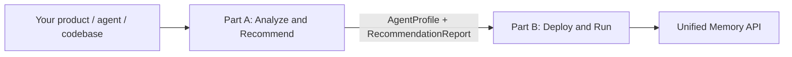

# Membrane

**Profile your agent. Evaluate memory architectures. Deploy the best one.**

Membrane is an open-source meta-layer for LLM-backed products. You call one API (plus optional context about your product, agent, or codebase). Membrane analyzes what you are building, runs evaluations against candidate memory architectures, and recommends — then deploys — the best design under your latency, cost, privacy, and reasoning constraints.

Membrane is **not** another memory store. It does not default to "embeddings in a vector DB." It chooses and composes architectures — vector RAG, temporal graphs, causal graphs, multi-graph hybrids (MAGMA-style), parametric + retrieval (MemVerse-style), and more — based on what your product actually needs.

---

## The problem

Most memory tools ship one architecture:

- Vector DB + similarity search
- A temporal knowledge graph
- Stateful agent memory
- SDK primitives you wire up yourself

Real products need different things. A cybersecurity agent needs temporal + entity + causal graphs and audit logs. A voice agent needs sub-200ms profile memory and async consolidation. A codebase agent needs repo graphs and tool memory. Picking the wrong architecture means bad retrieval, high latency, or expensive rewrites later.

Membrane treats memory architecture selection as a **first-class problem** — profiled, benchmarked, and explained.

---

## How it works



### Part A — Analyze & Recommend

Profiling agents understand your product. An evaluation engine scores candidate architectures. You get a ranked, explainable recommendation.

```
POST /v1/analyze   →  profile → eval → recommend
GET  /v1/jobs/{id} →  scores, winner, deployment manifest
```

### Part B — Deploy & Run

Membrane provisions the selected architecture and exposes a single Memory API your agent calls in production.

```
POST /v1/deploy       →  spin up infra, return endpoint
POST /memory/write    →  ingest experiences
POST /memory/query    →  retrieve context
GET  /memory/explain  →  show retrieval path
```

Part A and Part B are designed to be built and used independently. Part A is valuable on its own as an architecture audit. Part B can deploy from a hand-written manifest while Part A is still in progress.

**Full system design:** [docs/architecture.md](docs/architecture.md)

---

## What makes Membrane different

| Tool | What they are | Membrane |
|---|---|---|
| [Mem0](https://mem0.ai) | Universal memory layer / API | Chooses and composes architectures, not one default |
| [Zep / Graphiti](https://www.getzep.com) | Temporal context graph | Graphs when appropriate, plus vector, causal, multimodal, hybrid |
| [Letta](https://www.letta.com) | Stateful agents with memory | Infrastructure + evaluation + deployment, not an agent framework |
| [LangMem](https://blog.langchain.com/langmem-sdk-launch/) | SDK primitives for long-term memory | Architecture selection, benchmarking, deployment, observability |

---

## Example: product type → architecture

These are starting hypotheses. Membrane's eval engine validates or overrides them with measured scores.

| Product type | Likely memory architecture |
|---|---|
| Customer support chatbot | User profile + conversation summaries + semantic retrieval |
| Cybersecurity agent | Temporal graph + entity graph + causal graph + audit/provenance |
| Codebase agent | Repo graph + vector chunks + tool memory + issue/PR history |
| Voice agent | Low-latency profile memory + cache + async consolidation |
| Shopping / styling agent | Preference memory + visual embeddings + bounded forgetting |
| Research agent | Citation graph + episodic workspace + semantic long-term memory |

---

## Project status

**Early stage.** Architecture and roadmap are defined. Implementation is starting.

Current docs:

- [System architecture](docs/architecture.md) — full diagrams, Part A / Part B split, handoff contract, catalog, eval engine, roadmap
- [Part A: Analyze & Recommend](docs/part-a-analyze.md) — profiling, eval, selection strategy
- [Memory Architecture Knowledge Base](docs/memory-knowledge.md) — ingesting papers, docs, and blogs into the catalog

Planned next steps:

1. Shared schemas (`AgentProfile`, `RecommendationReport`, `DeploymentManifest`)
2. Architecture catalog YAML
3. Evaluation engine with cybersecurity example profile
4. Adapter SDK + VectorRAG reference implementation
5. End-to-end demo: analyze → recommend → deploy locally

---

## Repository layout (planned)

```
membrane/
├── analyze/          # Part A — profiling, eval, selection
├── deploy/           # Part B — provisioning, adapters, runtime API
├── schemas/          # Shared contracts between Part A and Part B
├── catalog/          # Memory architecture pattern registry
├── adapters/         # Plugins for Mem0, Graphiti, MAGMA, etc.
├── benchmarks/       # LoCoMo, LongMemEval, synthetic traces
├── examples/         # Cybersecurity, chatbot, codebase demos
└── docs/
    └── architecture.md
```

---

## Contributing

Membrane is open source. We are building in public. If you are working on agent memory — benchmarks, graph architectures, adapters, eval harnesses — issues and PRs are welcome once the initial scaffold lands.

---

## License

TBD.
