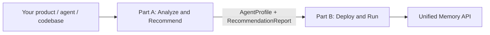

# Membrane

**Profile your agent. Evaluate memory architectures. Deploy the best one.**

Membrane is an open-source meta-layer for LLM-backed products. You call one API (plus optional context about your product, agent, or codebase). Membrane analyzes what you are building, runs evaluations against candidate memory architectures, and recommends — then deploys — the best design under your latency, cost, privacy, and reasoning constraints.

Membrane is **not** another memory store. It does not default to "embeddings in a vector DB." It **composes and evaluates** memory stacks — combining vector RAG, temporal graphs, session memory, multi-graph hybrids (MAGMA-style), and more — based on what your product actually needs. The winner may be a **hybrid** built from several catalog patterns, not a single off-the-shelf product.

---

## The problem

Most memory tools ship one architecture:

- Vector DB + similarity search
- A temporal knowledge graph
- Stateful agent memory
- SDK primitives you wire up yourself

Real products need different things. A cybersecurity agent needs temporal + entity + causal graphs and audit logs. A voice agent needs sub-200ms profile memory and async consolidation. A codebase agent needs repo graphs and tool memory. Picking the wrong architecture means bad retrieval, high latency, or expensive rewrites later.

Membrane treats memory architecture selection as a **first-class problem** — profiled, benchmarked, and explained.

---

## How it works



### Part A — Analyze & Recommend

Profiling agents understand your product. An evaluation engine scores **monolithic and hybrid** memory stacks. You get a ranked, explainable recommendation — often a composed stack, not a single pattern.

```
POST /v1/analyze   →  profile → eval → recommend
GET  /v1/jobs/{id} →  scores, winner, deployment manifest
```

### Part B — Deploy & Run

Membrane provisions the selected architecture and exposes a single Memory API your agent calls in production.

```
POST /v1/deploy       →  spin up infra, return endpoint
POST /memory/write    →  ingest experiences
POST /memory/query    →  retrieve context
GET  /memory/explain  →  show retrieval path
```

Part A and Part B are designed to be built and used independently. Part A is valuable on its own as an architecture audit. Part B can deploy from a hand-written manifest while Part A is still in progress.

**Full system design:** [docs/architecture.md](docs/architecture.md)

---

## What makes Membrane different

| Tool | What they are | Membrane |
|---|---|---|
| [Mem0](https://mem0.ai) | Universal memory layer / API | Chooses and composes architectures, not one default |
| [Zep / Graphiti](https://www.getzep.com) | Temporal context graph | Graphs when appropriate, plus vector, causal, multimodal, hybrid |
| [Letta](https://www.letta.com) | Stateful agents with memory | Infrastructure + evaluation + deployment, not an agent framework |
| [LangMem](https://blog.langchain.com/langmem-sdk-launch/) | SDK primitives for long-term memory | Architecture selection, benchmarking, deployment, observability |

---

## Example: product type → architecture

These are starting hypotheses. Membrane's eval engine validates or overrides them with measured scores.

| Product type | Likely memory architecture |
|---|---|
| Customer support chatbot | User profile + conversation summaries + semantic retrieval |
| Cybersecurity agent | Temporal graph + entity graph + causal graph + audit/provenance |
| Codebase agent | Repo graph + vector chunks + tool memory + issue/PR history |
| Voice agent | Low-latency profile memory + cache + async consolidation |
| Shopping / styling agent | Preference memory + visual embeddings + bounded forgetting |
| Research agent | Citation graph + episodic workspace + semantic long-term memory |

---

## Project status

**MAK K1–K5 implemented.** The Memory Architecture Knowledge Base is the current focus — ingest papers and docs, extract architecture knowledge, search the corpus.

```bash
pip install -e .          # Python 3.11+
membrane knowledge stats
membrane knowledge sync awesome-lists
membrane knowledge ingest arxiv:2601.03236
membrane knowledge index --rebuild
membrane knowledge search "temporal graph agent memory"
```

Set `MEMBRANE_LLM_API_KEY` (and optional `MEMBRANE_LLM_MODEL`) for LLM extraction; without it, a heuristic extractor is used for development.

**Next:** Part A (profiling, eval, recommendation) resumes after MAK K5. See [Part A building strategy](docs/part-a-analyze.md).

Current docs:

- [System architecture](docs/architecture.md) — full diagrams, Part A / Part B split, handoff contract, catalog, eval engine, roadmap
- [Part A: Analyze & Recommend](docs/part-a-analyze.md) — profiling, eval, selection strategy (deferred until MAK K5)
- [Profiling design](docs/profiling.md) — codebase + website → AgentProfile
- [Memory Architecture Knowledge Base](docs/memory-knowledge.md) — ingesting papers, docs, and blogs into the catalog

Planned next steps:

1. Part A schemas (`AgentProfile`, `RecommendationReport`, `DeploymentManifest`)
2. Evaluation engine with cybersecurity example profile
3. Architecture composer + selector wired to `MAKClient`
4. Profiling agent pipeline
5. MAK K6 product doc crawl + K7 Part A integration

---

## Repository layout

```
membrane/
├── membrane/
│   ├── cli.py              # `membrane knowledge` CLI
│   ├── catalog/            # taxonomy + pattern YAML registry
│   └── knowledge/          # MAK — fetch, sync, extract, index, search
├── analyze/                # Part A — profiling, eval, selection (planned)
├── deploy/                 # Part B — provisioning, adapters, runtime API (planned)
├── schemas/                # Shared contracts (planned)
├── adapters/               # Architecture plugins (planned)
├── benchmarks/             # LoCoMo, LongMemEval, synthetic traces (planned)
├── examples/               # Domain demos (planned)
├── tests/
└── docs/
```

---

## Contributing

Membrane is open source. We are building in public. If you are working on agent memory — benchmarks, graph architectures, adapters, eval harnesses — issues and PRs are welcome once the initial scaffold lands.

---

## License

TBD.
