# Membrane System Architecture

Membrane is a meta-layer for LLM-backed products. It profiles your agent, runs memory evaluations, recommends the best architecture under your latency, cost, privacy, and reasoning constraints, and deploys it behind a single Memory API.

Membrane is **not** another memory store. It chooses and composes memory architectures — vector, graph, hybrid, or research-backed patterns like MAGMA and MemVerse — rather than shipping one default approach.

---

## Table of Contents

1. [Overview](#overview)
2. [Two-Part Split](#two-part-split)
3. [Part A: Analyze & Recommend](#part-a-analyze--recommend)
4. [Part B: Deploy & Run](#part-b-deploy--run)
5. [Handoff Contract](#handoff-contract)
6. [System Diagrams](#system-diagrams)
7. [Architecture Catalog](#architecture-catalog)
8. [Evaluation Engine](#evaluation-engine)
9. [Adapter Layer](#adapter-layer)
10. [API Surface](#api-surface)
11. [Repo Layout](#repo-layout)
12. [Build Roadmap](#build-roadmap)
13. [Positioning](#positioning)
14. [Design Decisions](#design-decisions)

---

## Overview

Membrane performs five jobs:

1. **Profile** the customer's product, agent, feature, or codebase
2. **Evaluate** candidate memory architectures against their requirements
3. **Recommend** the best architecture (or hybrid composition)
4. **Deploy** it (infra + unified memory API)
5. **Continuously judge** memory quality in production

One API in, best memory architecture out — judged by Membrane's evaluation system, not by marketing or defaults.

The system splits into two planes:

- **Control plane** — analyzes the product, runs evaluations, selects architecture, provisions infra
- **Runtime plane** — the deployed memory system the customer's agent calls in production

---

## Two-Part Split

Membrane is split into **two independent workstreams** connected through a well-defined handoff contract. They can be built, tested, and open-sourced in parallel.

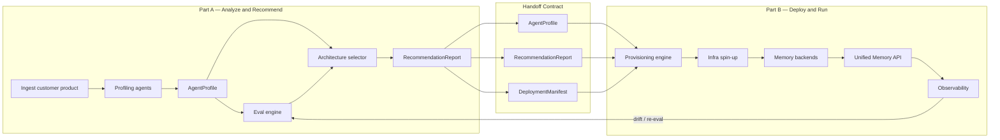

| | Part A: Analyze & Recommend | Part B: Deploy & Run |
|---|---|---|
| **Question it answers** | What memory architecture fits this product? | How do we run it in production? |
| **Input** | Repo, spec, traces, constraints | `RecommendationReport` + `DeploymentManifest` |
| **Output** | Ranked architectures + explainable report | Live Memory API endpoint + infra |
| **Core tech** | LLM profiling agents, eval harness, catalog | Docker/Terraform, adapters, FastAPI runtime |
| **Ships standalone?** | Yes — architecture audit without deploy | Yes — with a manual architecture spec |
| **Primary API** | `POST /v1/analyze`, `GET /v1/jobs/{id}` | `POST /v1/deploy`, `POST /memory/*` |

---

## Part A: Analyze & Recommend

**Goal:** Given a customer's product, agent, or codebase, produce a data-backed recommendation for the best memory architecture.

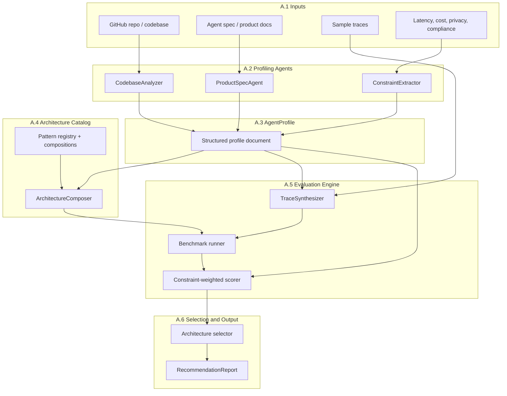

### Sub-parts

| Sub-part | Name | What it does | Key deliverables |
|---|---|---|---|
| **A.1** | Input ingestion | Accept and normalize customer material | Input schema, repo cloner, trace parser |
| **A.2** | Profiling agents | AI agents that understand the product | CodebaseAnalyzer, ProductSpecAgent, ConstraintExtractor |
| **A.3** | AgentProfile | Central structured contract | Pydantic schema, validators, example profiles |
| **A.4** | Architecture catalog | Registry of all memory patterns | YAML catalog, product-type mappings, ArchitectureComposer |
| **A.5** | Evaluation engine | Judges candidates with benchmarks | LoCoMo/LongMemEval integration, synthetic trace gen, scorer |
| **A.6** | Selection & reporting | Ranks and explains the winner | Selector, RecommendationReport, DeploymentManifest spec |

### Part A API

```
POST /v1/analyze          → start analyze job, return job_id
GET  /v1/jobs/{id}        → status, agent_profile, candidates, scores, recommendation, deployment_manifest
GET  /v1/jobs/{id}/report → human-readable recommendation report
```

CLI: `membrane analyze --repo URL --constraints constraints.yaml`

### Part A MVP

`membrane analyze --profile examples/cybersecurity.yaml` produces a ranked recommendation report without any deployment.

---

## Part B: Deploy & Run

**Goal:** Take a `RecommendationReport` + `DeploymentManifest` and produce a running memory system the customer's agent can call.

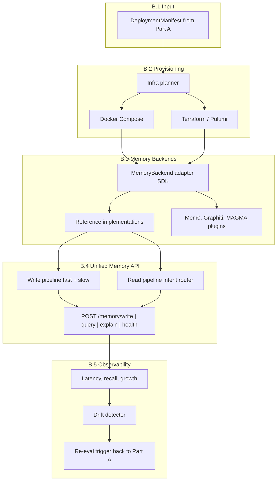

### Sub-parts

| Sub-part | Name | What it does | Key deliverables |
|---|---|---|---|
| **B.1** | Manifest parser | Read and validate DeploymentManifest | Schema, validator, architecture → component mapping |
| **B.2** | Provisioning engine | Spin up required infra | Docker Compose templates per pattern, Terraform modules (later) |
| **B.3** | Adapter layer | Pluggable memory backends | MemoryBackend SDK, VectorRAG + graph reference impls |
| **B.4** | Unified Memory API | Production runtime for customer's agent | FastAPI service, write/read pipelines, intent router |
| **B.5** | Observability | Monitor production, detect drift | Metrics collector, health endpoint, re-eval feedback |

### Part B API

```
POST /v1/deploy                    → accept DeploymentManifest, return deploy job_id
GET  /v1/deploy/{id}               → status, memory_api_endpoint, credentials

POST /memory/write                 → ingest experience
POST /memory/query                 → retrieve context for agent turn
GET  /memory/explain/{query_id}    → retrieval path (graph architectures)
GET  /memory/health                → latency, hit rate, growth
```

CLI: `membrane deploy --manifest deployment.yaml`

### Part B MVP

`membrane deploy --manifest examples/cybersecurity_deploy.yaml` spins up a local memory stack and returns a working `/memory/query` endpoint.

---

## Handoff Contract

Part A produces three artifacts that Part B consumes. Part B never re-decides the architecture. Part A never touches infra.

```yaml
# 1. AgentProfile — full understanding of the customer's product
agent_profile:
  product_type: cybersecurity_agent
  memory_needs: [temporal, entity, causal, audit]
  constraints:
    latency_p99_ms: 200
    privacy: on_prem
  scale:
    events_per_day: 50000

# 2. RecommendationReport — why this architecture won
recommendation:
  winner: multi_graph_hybrid
  composition: [TemporalGraph, EntityGraph, CausalGraph, AuditProvenance]
  scores:
    multi_graph_hybrid: 0.87
    vector_rag: 0.41
  explanation: "Causal reasoning eval decisive; vector-only failed temporal chain queries"

# 3. DeploymentManifest — machine-readable deploy spec for Part B
deployment_manifest:
  architecture_id: multi_graph_hybrid
  mode: local  # or cloud
  components:
    - { type: vector_db, engine: qdrant }
    - { type: graph_db, engine: neo4j }
    - { type: cache, engine: redis }
    - { type: audit_log, engine: postgres }
  adapter: membrane.adapters.multigraph_lite
```

### End-to-end lifecycle

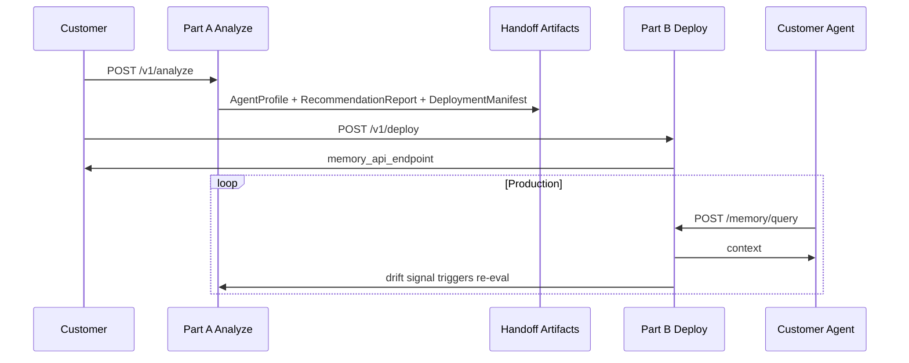

---

## System Diagrams

### Master architecture — control plane + runtime plane

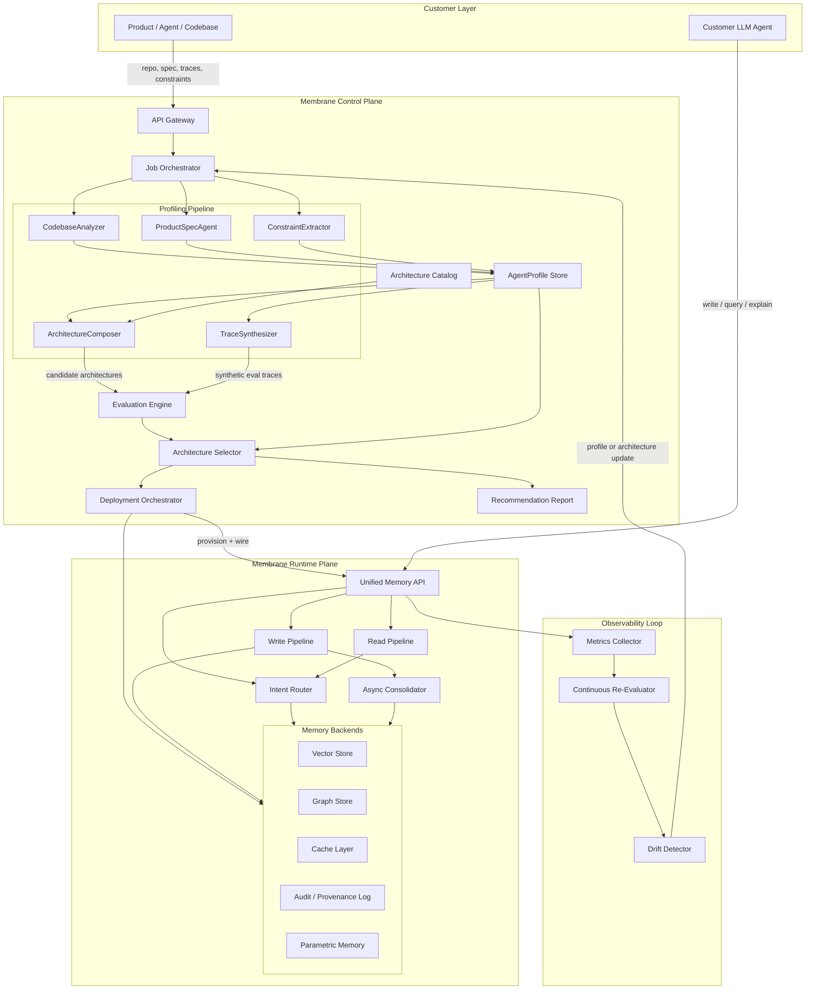

### Layer breakdown

| Layer | Responsibility | Key outputs |
|---|---|---|
| Customer layer | Provides source material; runs the LLM agent | repo, spec, traces, constraints |
| API gateway | Single entry point, auth, job lifecycle | `job_id`, status, results |
| Profiling pipeline | AI agents understand the product | `AgentProfile` |
| Architecture catalog | Registry of memory patterns and compositions | pattern defs, infra reqs, eval affinities |
| Evaluation engine | Judges candidate architectures | per-architecture scores |
| Architecture selector | Ranks candidates, explains recommendation | ranked list + report |
| Deployment orchestrator | Provisions infra, wires adapters | running runtime stack |
| Runtime plane | Serves production memory reads/writes | low-latency context retrieval |
| Observability loop | Monitors production, detects drift | health metrics, re-recommendations |

### Runtime plane — cybersecurity hybrid example

Example deployed architecture: TemporalGraph + EntityGraph + CausalGraph + AuditProvenance (MAGMA-style multi-graph).

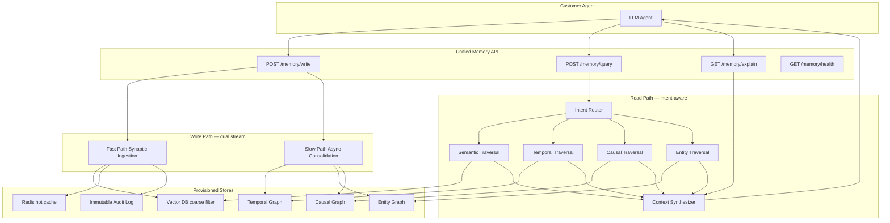

### AgentProfile as central contract

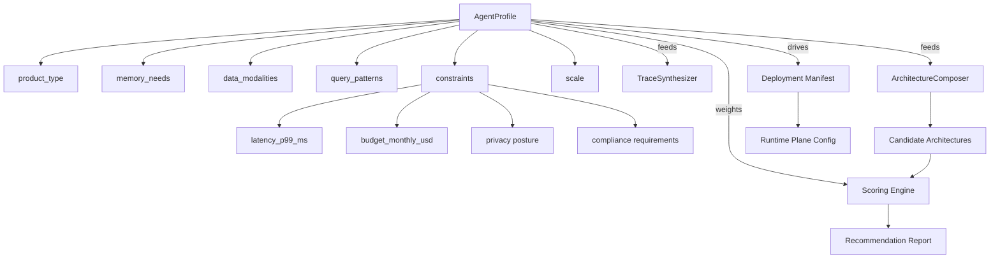

---

## Architecture Catalog

A versioned registry of **memory architecture patterns**, not just backends.

| Pattern | Best for | Key components |
|---|---|---|
| VectorRAG | Semantic lookup, docs, FAQs | Embeddings + vector DB + chunking |
| ProfileMemory | User prefs, voice, personalization | Structured KV + fast cache |
| ConversationSummary | Long chat sessions | Rolling summaries + episodic store |
| TemporalGraph | Event sequences | Time-indexed graph (Zep/Graphiti-style) |
| EntityGraph | Relationships between actors/assets | Entity nodes + typed edges |
| CausalGraph | Root cause, incident chains | Causal edges + traversal policies |
| RepoGraph | Codebase agents | AST/symbol graph + vector chunks + tool memory |
| MultiGraph (MAGMA-style) | Long-horizon reasoning | Semantic + temporal + causal + entity graphs with intent routing |
| HybridParametric (MemVerse-style) | Multimodal lifelong learning | MMKG + short-term cache + parametric distillation |
| ProceduralMemory | Tool use, workflows | Skill/action traces + replay |
| AuditProvenance | Security/compliance | Immutable event log + lineage |

Architectures are **composable**. Example: cybersecurity = `TemporalGraph + EntityGraph + CausalGraph + AuditProvenance`.

### Product type → architecture mapping (starting hypotheses)

The evaluation engine validates or overrides these with measured scores.

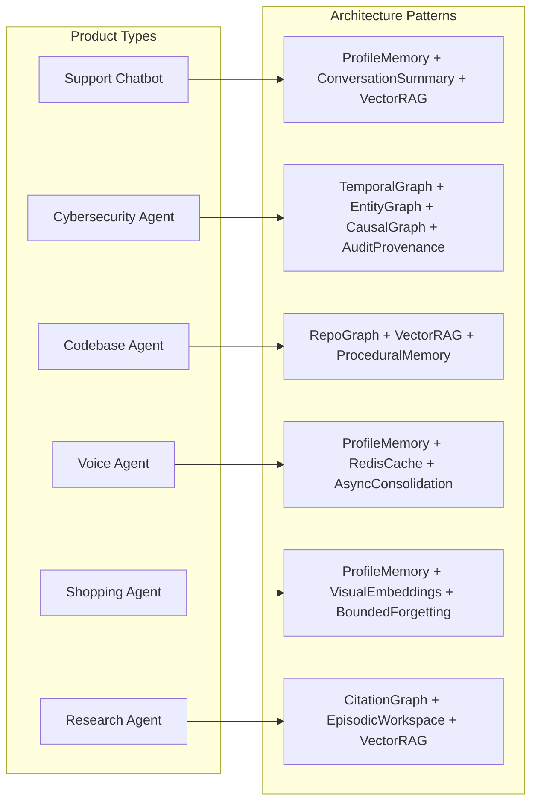

| Product type | Likely memory architecture |
|---|---|
| Customer support chatbot | User profile memory + conversation summaries + semantic retrieval |
| Cybersecurity agent | Temporal graph + entity graph + causal event graph + provenance/audit logs |
| Codebase agent | Repo graph + vector chunks + execution/tool memory + issue/PR history |
| Voice agent | Ultra-low-latency profile memory + cache + async background consolidation |
| Shopping/styling agent | User preference memory + visual/product embeddings + bounded forgetting |
| Research agent | Citation graph + episodic workspace + semantic long-term memory |

---

## Evaluation Engine

Every candidate architecture is scored by Membrane's evaluation system.

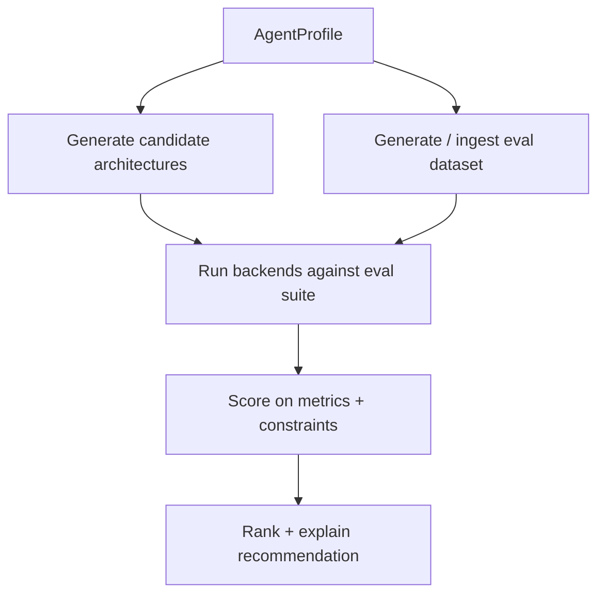

### Eval dataset sources

- Standard benchmarks: LoCoMo, LongMemEval, domain-specific suites
- Synthetic traces generated from the customer's codebase/product spec
- Customer-provided traces (optional)
- Constraint stress tests: latency under load, privacy isolation, memory growth bounds

### Scoring dimensions (weighted by profile constraints)

| Metric | What it measures |
|---|---|
| Recall@k / answer accuracy | Does retrieval surface the right context? |
| Temporal reasoning | Can it answer "what happened before X"? |
| Causal reasoning | Can it trace cause-effect chains? |
| Latency p50/p99 | Meets real-time requirements? |
| Write throughput | Handles ingestion rate? |
| Cost per 1M queries | Within budget? |
| Memory growth | Bounded forgetting / consolidation working? |
| Explainability | Can retrieval path be shown? |
| Privacy | Data residency, tenant isolation, audit trail completeness |

---

## Adapter Layer

Membrane orchestrates existing systems via a common adapter interface. It does not reimplement every backend.

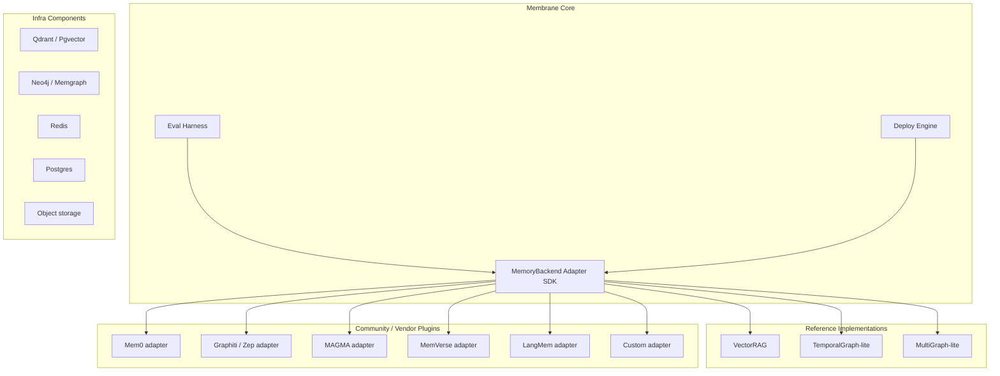

Every adapter implements:

```
write(event)           → store experience
query(intent, context) → retrieved memories
explain(query_id)      → retrieval path
benchmark(eval_corpus) → scores
teardown()             → cleanup
```

---

## API Surface

### Analyze flow (Part A)

```
POST /v1/analyze
{
  "source": {
    "type": "github_repo | agent_spec | product_description | traces",
    "url": "...",
    "spec": { }
  },
  "constraints": {
    "latency_p99_ms": 200,
    "privacy": "on_prem | cloud | hybrid",
    "budget_monthly_usd": 500,
    "compliance": ["SOC2", "audit_log"]
  }
}

GET /v1/jobs/{job_id}
→ { status, profile, candidates, scores, recommendation, deployment_manifest }

POST /v1/deploy
{ "job_id", "architecture_id", "mode": "local | cloud" }
→ { memory_api_endpoint, credentials, infra_manifest }
```

### Memory API (Part B runtime)

```
POST /memory/write   — ingest experience
POST /memory/query   — retrieve context for agent turn
GET  /memory/explain — show retrieval path
GET  /memory/health  — latency, hit rate, growth metrics
```

---

## Repo Layout

```
membrane/
├── schemas/                    # Shared contracts — handoff boundary
│   ├── agent_profile.py
│   ├── recommendation.py
│   └── deployment_manifest.py
├── analyze/                    # Part A
│   ├── ingest/                 # A.1
│   ├── agents/                 # A.2
│   ├── profile/                # A.3
│   ├── catalog/                # A.4
│   ├── eval/                   # A.5
│   └── select/                 # A.6
├── deploy/                     # Part B
│   ├── manifest/               # B.1
│   ├── provision/              # B.2
│   ├── adapters/               # B.3
│   ├── runtime/                # B.4
│   └── observability/          # B.5
├── catalog/                    # YAML architecture definitions
├── adapters/                   # Community/vendor plugins
├── benchmarks/                 # LoCoMo, LongMemEval, synthetic datasets
├── examples/                   # Cybersecurity, chatbot, codebase demos
├── cli/                        # membrane analyze | deploy | eval
└── docs/
    ├── architecture.md         # This document
    ├── part-a-analyze.md       # Part A deep dive (planned)
    └── part-b-deploy.md        # Part B deep dive (planned)
```

---

## Build Roadmap

Work Part A and Part B in parallel. Each track has its own MVP.

### Track 0 — Shared foundation

- `docs/architecture.md` (this document)
- Shared schemas: `AgentProfile`, `RecommendationReport`, `DeploymentManifest`
- Architecture catalog YAML
- Repo scaffold + README

### Track A — Analyze & Recommend

| Phase | Deliverable | Standalone value |
|---|---|---|
| A-1 | AgentProfile schema + catalog | Document memory needs for any product |
| A-2 | Eval engine + scorer | Benchmark any memory backend |
| A-3 | Profiling agents | Auto-generate profiles from repos |
| A-4 | Input ingestion + selector + report | Full `membrane analyze` CLI |
| A-5 | `POST /v1/analyze` HTTP service | API-first analyze flow |

**Track A MVP:** Hand-written cybersecurity profile → eval ranks graph hybrid above vector RAG → explainable report.

### Track B — Deploy & Run

| Phase | Deliverable | Standalone value |
|---|---|---|
| B-1 | Adapter SDK + VectorRAG ref impl | Pluggable memory backend interface |
| B-2 | Manifest parser + Docker Compose | `membrane deploy` for simple RAG |
| B-3 | Unified Memory API | Production `/memory/query` endpoint |
| B-4 | Graph + hybrid adapters + templates | Deploy multi-graph architectures |
| B-5 | Observability + drift feedback | Production monitoring |
| B-6 | Terraform provisioning | Hosted commercial deploy |

**Track B MVP:** Hand-written deployment manifest → local Docker stack → working Memory API.

### Integration milestone

Wire Part A's `DeploymentManifest` directly into Part B's `membrane deploy` for a cybersecurity end-to-end demo.

---

## Positioning

| Existing tool | What they are | Membrane's angle |
|---|---|---|
| Mem0 | Universal memory layer/API | Choose and compose architectures, not provide one |
| Zep/Graphiti | Temporal context graph | Temporal graphs when appropriate, plus vector, procedural, causal, multimodal, hybrid |
| Letta | Stateful agents with memory | Infrastructure + evaluation + deployment, not an agent framework |
| LangMem | SDK primitives for long-term memory | Architecture selection, benchmarking, cloud deployment, observability |

---

## Design Decisions

1. **Orchestrate, don't reimplement everything.** Membrane's value is selection + evaluation + deployment. Backends plug in via adapters.

2. **Evaluation is the moat.** Ranking architectures with transparent, reproducible benchmarks on your product's profile is the hard part.

3. **AgentProfile is the contract.** Everything downstream derives from this structured document.

4. **Explainability by default.** Recommendations include scores, tradeoffs, and retrieval paths.

5. **Hybrid is the norm.** Most real products need composition. The catalog and selector must natively support multi-pattern architectures.

---

## Tech Stack

| Layer | Choice |
|---|---|
| Language | Python |
| API | FastAPI |
| Schema | Pydantic v2 |
| Catalog | YAML registry |
| Agents | LLM with structured output → AgentProfile |
| Eval | Custom runner + LoCoMo, LongMemEval |
| Local deploy | Docker Compose |
| Cloud deploy | Terraform / Pulumi (later) |
| Vector store | Qdrant / Pgvector |
| Graph store | Neo4j / Memgraph |
| Cache | Redis |
| Audit log | Postgres |

---

## Open Source vs Hosted

```mermaid
flowchart TB
  subgraph ossPath ["Open Source — customer runs locally"]
    CLI["membrane CLI"]
    LocalEval["Local eval runner"]
    DockerCompose["Docker Compose manifests"]
    LocalRuntime["Self-hosted Memory API"]
  end

  subgraph hostedPath ["Hosted — future commercial"]
    CloudAPI["Membrane Cloud API"]
    ManagedProfiler["Managed profiling agents"]
    CloudEval["Cloud eval cluster"]
    TF["Terraform provisioning"]
    ManagedRuntime["Managed Memory API"]
    Dashboard["Observability dashboard"]
  end

  CLI --> LocalEval
  LocalEval --> DockerCompose
  DockerCompose --> LocalRuntime

  CloudAPI --> ManagedProfiler
  ManagedProfiler --> CloudEval
  CloudEval --> TF
  TF --> ManagedRuntime
  ManagedRuntime --> Dashboard
```

Both paths run the same `AgentProfile` → eval → recommend → deploy flow. The hosted path adds managed infra, scale, and SLAs.
