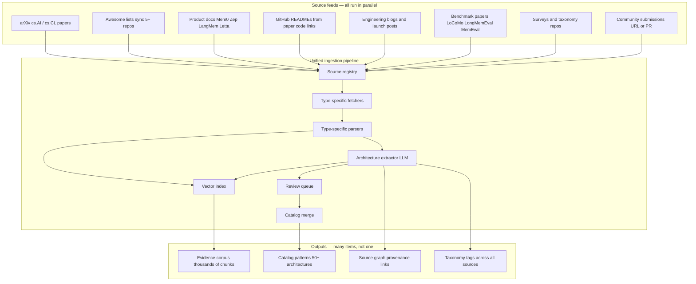
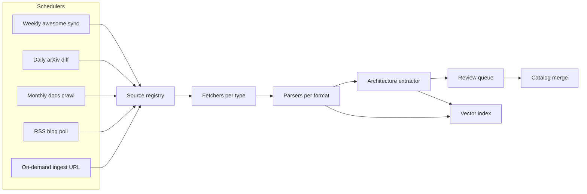
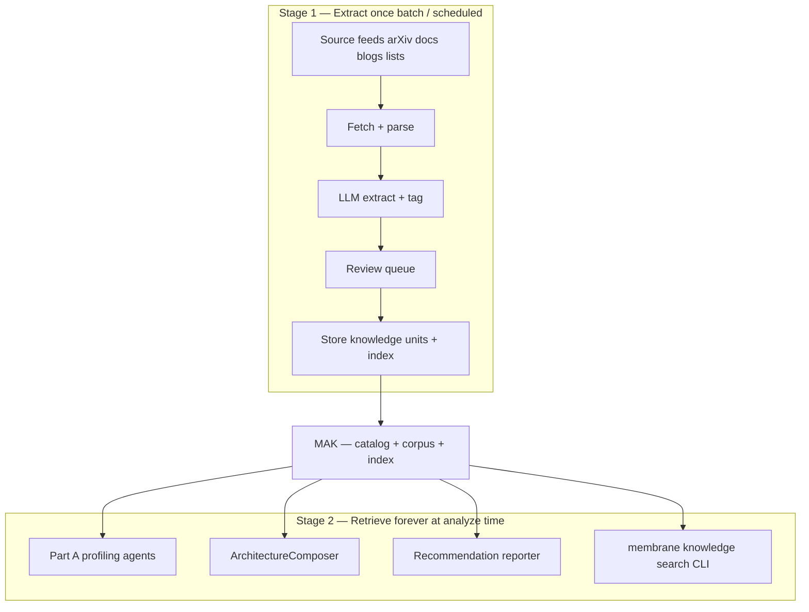
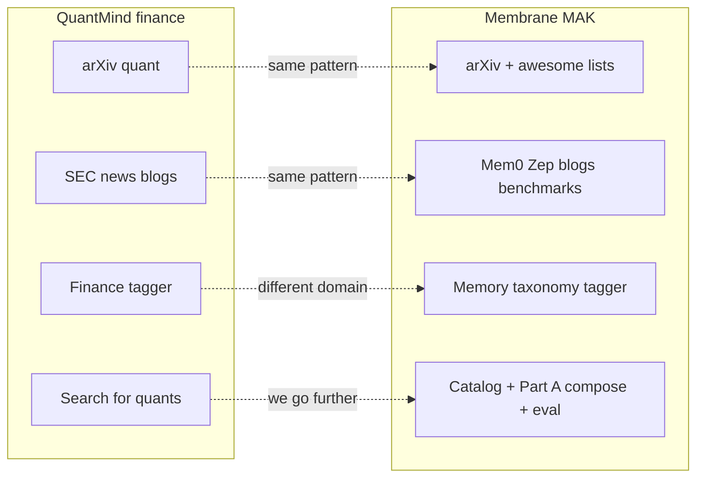

# Memory Architecture Knowledge Base (MAK)

How Membrane accumulates, structures, and uses knowledge about memory architectures — from research papers (MAGMA, MemVerse, A-MEM) to engineering docs (Mem0, Zep, LangMem) and blogs.

**Goal:** Part A's recommendations are grounded in the widest available evidence, not a handful of hardcoded patterns.

**Core principle:** Ingest and extract from **many source types in parallel** — not one paper at a time, not one architecture at a time. Design for this layer is [QuantMind-inspired](#quantmind-inspired-mak-design) (two-stage extract/retrieve, unified pipeline, provenance-first knowledge units).

---

## The wrong approach vs the right approach

| Approach | Problem |
|---|---|
| Fine-tune one model on all papers | Expensive, goes stale weekly, not explainable, can't cite sources |
| Hardcode 8 patterns in YAML | Misses new research, no nuance, no "why MAGMA over Graphiti for this profile" |
| Dump papers into a vector DB and RAG | Retrieves chunks but no structured comparison, inconsistent recommendations |

**Right approach:** A **dual-layer knowledge system**:

1. **Structured catalog** — machine-readable architecture patterns (what Part A selects and deploys)
2. **Evidence corpus** — papers, docs, blogs with embeddings (what Part A reasons over and cites)

Plus an **ingestion pipeline** that continuously turns new sources into catalog entries and retrievable evidence.

### Multi-source ingestion (the default model)

Like [QuantMind](https://github.com/LLMQuant/quant-mind), Membrane runs **one pipeline across all source types**. Each source is fetched, parsed, extracted, reviewed, and indexed through the same stages. A single catalog pattern (e.g. `magma_multigraph`) may be backed by **multiple sources** — paper + GitHub README + blog post + benchmark results.



**What this means in practice:**

| Wrong mental model | Right mental model |
|---|---|
| "Ingest the MAGMA paper" | "Ingest everything in the agent-memory field; MAGMA is one result" |
| One source → one catalog entry | Many sources → one catalog entry; one source → many extractions |
| Manual curation only | Automated sync + extraction + human review at scale |
| RAG over one paper | RAG over full corpus; compare patterns across sources |

---

## Layer 1: Structured architecture catalog

The catalog is the **executable** layer — Part B deploys from it, Part A scores against it.

Each pattern is a YAML entry derived from **one or more** ingested sources. Example — note four linked sources for one pattern:

```yaml
# catalog/patterns/magma_multigraph.yaml
id: magma_multigraph
name: MAGMA Multi-Graph Agentic Memory
version: "1.0"
sources:                          # multiple sources, one pattern
  - type: paper
    source_id: arxiv_2601_03236
    url: https://arxiv.org/abs/2601.03236
  - type: code
    source_id: github_magma
    url: https://github.com/FredJiang0324/MAGMA
  - type: blog
    source_id: magma_paper_note
    url: https://en.papernotes.org/...
  - type: benchmark
    source_id: locomo_magma_results
    notes: "Reported LoCoMo temporal + multi-hop scores from paper Table 3"

taxonomy:
  memory_types: [episodic, semantic]
  structures: [multi_graph, vector]
  graphs: [semantic, temporal, causal, entity]

memory_needs_served: [temporal, causal, entity, semantic]
query_patterns_served: [temporal_reasoning, causal_chains, entity_traversal, similarity_lookup]

components:
  - fast_path_synaptic_ingestion
  - async_consolidation
  - intent_router
  - policy_guided_graph_traversal

infra_requirements:
  - { type: vector_db }
  - { type: graph_db }

constraints:
  latency_profile: medium  # ~1.5s query per paper
  cost_profile: medium_high
  privacy: self_hostable
  explainability: high  # graph traversal paths

eval_affinities:
  benchmarks: [locomo_temporal, locomo_multi_hop, longmemeval_temporal]
  excels_at: [temporal_reasoning, causal_reasoning, long_horizon]
  weak_at: [ultra_low_latency, simple_faq]

composable_with: [audit_provenance, profile_memory]

implementation:
  adapter: adapters.magma  # or membrane reference impl
  reference_impl: adapters.multigraph_lite
```

### Catalog taxonomy (ontology)

Organize patterns along axes from surveys (OpenDataBox, TeleAI, Evolving-LLM-Agent-Memory-Survey):

| Axis | Values |
|---|---|
| **Storage** | Parametric, retrieval-based, hybrid |
| **Structure** | Flat buffer, vector index, tree, single graph, multi-graph, MMKG |
| **Memory type** | Working, episodic, semantic, procedural, profile |
| **Write path** | Sync only, fast+slow dual stream, consolidation pipeline |
| **Read path** | Similarity, graph traversal, intent routing, parametric recall |
| **Modality** | Text, code, multimodal, structured events |

The taxonomy lets `ArchitectureComposer` query: "which patterns serve `causal` + `temporal` + `explainability: high`?"

---

## Layer 2: Evidence corpus

Raw and processed source material for RAG and citation.

### Source types and fetchers

Every source type has a dedicated fetcher + parser, unified extraction schema on the other side.

| Source type | Examples | Fetcher | Parser | Sync cadence |
|---|---|---|---|---|
| **arXiv paper** | MAGMA, MemVerse, A-MEM, LoCoMo | `arxiv` API + httpx PDF | PyMuPDF / arXiv HTML | Daily from awesome-list diff |
| **ACL/OpenReview** | Venue papers without arXiv | HTTP | HTML / PDF | Weekly |
| **Awesome list** | Tsinghua, Evolving-LLM-Survey, OpenDataBox | GitHub API | README markdown parser | Weekly |
| **Survey paper** | "Memory in the Age of AI Agents" | arXiv | PDF/HTML | On publish |
| **Product docs** | Mem0, Zep, Graphiti, LangMem, Letta | Crawl / sitemap | HTML → markdown (trafilatura) | Monthly |
| **GitHub README** | Any paper's code repo | GitHub API | Markdown | Weekly with awesome sync |
| **GitHub repo deep** | Full adapter implementations | GitHub API | Selective file tree | On demand |
| **Blog / post** | ByteRover, Mem0 launch, paper notes | HTTP / RSS | Readability extraction | RSS daily |
| **Benchmark protocol** | LoCoMo, LongMemEval, MemEval | arXiv + GitHub | PDF + README | Once + on update |
| **Community URL** | User-submitted link | HTTP | Auto-detect format | On submit |

### Source registry (`knowledge/sources.yaml`)

The registry tracks **all sources independently** — thousands of entries, not one per pattern:

```yaml
# Papers (from awesome-list sync — auto-populated)
- id: arxiv_2601_03236
  type: arxiv_paper
  url: https://arxiv.org/abs/2601.03236
  title: "MAGMA: A Multi-Graph based Agentic Memory Architecture"
  tags: [multi_graph, temporal, causal]
  status: cataloged
  pattern_ids: [magma_multigraph]

- id: arxiv_2512_03627
  type: arxiv_paper
  url: https://arxiv.org/abs/2512.03627
  title: "MemVerse: Multimodal Memory for Lifelong Learning Agents"
  status: extracted
  pattern_ids: []

# Product docs (standing sources — re-crawl)
- id: mem0_docs
  type: product_docs
  url: https://docs.mem0.ai
  sync: crawl_monthly
  status: indexed
  pattern_ids: [mem0_universal]

- id: zep_graphiti_docs
  type: product_docs
  url: https://help.getzep.com
  sync: crawl_monthly
  pattern_ids: [temporal_graph, graphiti]

# Awesome lists (feed generators — not catalog entries themselves)
- id: awesome_tsinghua
  type: awesome_list
  url: https://github.com/TsinghuaC3I/Awesome-Memory-for-Agents
  sync: github_weekly
  last_sync: 2026-06-25
  discovered_paper_count: 87

- id: awesome_evolving_survey
  type: awesome_list
  url: https://github.com/FeishuLuo/Evolving-LLM-Agent-Memory-Survey
  sync: github_weekly
  discovered_paper_count: 140

# Blogs
- id: byterover_locomo_post
  type: blog
  url: https://www.byterover.dev/blog/benchmark-ai-agent-memory
  tags: [locomo, benchmark, mem0, graphiti]
  status: indexed

### Chunk storage

Each ingested source produces many chunks. Source IDs are generic — not tied to one paper name:

```json
{
  "source_id": "arxiv_2601_03236",
  "source_type": "arxiv_paper",
  "chunk_id": "arxiv_2601_03236_sec4_retrieval",
  "text": "...",
  "section": "Policy-Guided Graph Traversal",
  "tags": ["multi_graph", "retrieval", "temporal"],
  "extracted_claims": [
    "Retrieval formulated as traversal over four orthogonal graphs",
    "Dual-stream write decouples fast ingestion from async consolidation"
  ]
}
```

```json
{
  "source_id": "mem0_docs",
  "source_type": "product_docs",
  "chunk_id": "mem0_docs_memory_add_api",
  "text": "...",
  "section": "POST /memories",
  "tags": ["vector", "api", "user_memory"],
  "pattern_candidates": ["mem0_universal", "profile_memory"]
}
```

---

## Layer 3: Ingestion pipeline

Continuous, **multi-source** pipeline — not a one-time scrape of one paper.



### Step 0: Bootstrap from awesome lists (discover hundreds of sources)

**This is the entry point — not manual MAGMA ingestion.**

Sync 5+ awesome list repos → parse every paper link → populate `sources.yaml` with 100–200+ pending entries → queue all for fetch.

| List | Expected yield |
|---|---|
| [Evolving-LLM-Agent-Memory-Survey](https://github.com/FeishuLuo/Evolving-LLM-Agent-Memory-Survey) | 140+ papers, 40+ benchmarks |
| [Awesome-Memory-for-Agents](https://github.com/TsinghuaC3I/Awesome-Memory-for-Agents) | 80+ papers |
| [awesome-agent-memory](https://github.com/OpenDataBox/awesome-agent-memory) | Taxonomy-tagged methods |
| [Awesome-Agent-Memory](https://github.com/TeleAI-UAGI/Awesome-Agent-Memory) | Papers + products + benchmarks |
| [Awesome-Agent-Memory-Papers](https://github.com/yyyujintang/Awesome-Agent-Memory-Papers) | 90+ papers, 7 surveys |

Parser extracts per row: `title`, `url`, `year`, `category_tags`, `github_url` → creates registry entries.

### Step 1: Parallel fetch (all source types)

```bash
# Batch ingest — not single-paper
membrane knowledge sync awesome-lists          # discover new sources
membrane knowledge fetch --pending             # fetch all pending sources
membrane knowledge fetch --type product_docs   # re-crawl Mem0, Zep, etc.
membrane knowledge ingest --url <any-url>      # ad-hoc single source
```

| Format | Parser |
|---|---|
| arXiv PDF/HTML | PyMuPDF / arXiv HTML + section splitter |
| GitHub README | Markdown |
| Product docs | Crawl + trafilatura HTML→markdown |
| Blogs | URL fetch + readability extraction |
| Awesome list README | Link + metadata parser (no full PDF) |

### Step 2: Structured extraction (same schema for every source type)

For **every** ingested source — paper, doc page, blog, README — run the same extraction schema:

```python
class ArchitectureExtraction(BaseModel):
    name: str
    one_line_summary: str
    taxonomy_tags: list[str]
    memory_needs_served: list[MemoryNeed]
    query_patterns_served: list[QueryPattern]
    components: list[str]
    write_path: str
    read_path: str
    infra_requirements: list[str]
    reported_metrics: dict  # benchmark → score from paper
    strengths: list[str]
    weaknesses: list[str]
    comparable_to: list[str]  # other pattern ids
    implementation_available: bool
    code_url: str | None
    confidence: float
    evidence_quotes: list[str]  # direct quotes for citation
```

Output goes to **review queue**. Extractions from multiple sources may **merge into one catalog pattern** (e.g. MAGMA paper + MAGMA repo README + LoCoMo scores → `magma_multigraph`).

### Step 3: Human review → catalog merge

Review workflow (or PR-based for OSS):
- Approve → create or update `catalog/patterns/{id}.yaml`
- Link `source_id` → `pattern_id` in registry
- Reject → flag for re-extraction
- Merge → combine extractions from multiple sources into one pattern

### Step 4: Index for RAG

All approved chunks from **all sources** → single vector index. Queries span the full corpus:

```bash
membrane knowledge search "parametric memory distillation multimodal"
membrane knowledge search "temporal graph vs vector RAG tradeoffs"
membrane knowledge compare mem0_universal graphiti temporal_graph
```

---

## Layer 4: How Part A uses MAK

### ArchitectureComposer

```
AgentProfile
    +
Profile-similarity retrieval (catalog + MAK)
    +
RAG comparison across sources
    ↓
3-5 candidate architectures with citations (no hard elimination)
```

The composer queries MAK:
1. Retrieve top patterns by profile similarity + memory-need coverage
2. LLM composes 3–5 diverse candidates (constraints as preferences, not gates)
3. Enrich with RAG across **all sources**
4. Pass all candidates to eval — constraint fit measured there, not filtered here

### Profiling agents

When LLM profiles a product, retrieve from the **full corpus** — papers, docs, blogs — not one architecture:

```
System: You are profiling an agent. Reference material from Membrane's knowledge base:
[retrieved chunks: 2 papers, 1 product doc, 1 benchmark — ranked by relevance to profile]

Output AgentProfile grounded in this evidence.
```

### Recommendation reporter

Citations pull from **multiple source types**:

```markdown
## Recommended: multi_graph_hybrid

**Why:** Your profile requires temporal + causal reasoning with explainability.

**Evidence (cross-source):**
- MAGMA paper (Jiang et al., ACL 2026) — multi-graph traversal on LoCoMo temporal
- Graphiti docs (Zep) — production temporal graph patterns for agents
- Membrane eval on your profile: multi_graph 0.87 vs vector_rag 0.41
- ByteRover benchmark post — vector-only baselines fail temporal multi-hop at scale

**Simpler alternative:** Mem0 docs — universal memory API, lower infra complexity if
latency budget relaxes to 500ms.
```

### Eval engine

Catalog `eval_affinities` maps patterns → benchmark suites:

```yaml
eval_affinities:
  benchmarks: [locomo_temporal, cyber_causal_pack]
```

When a new paper reports scores, ingestion pipeline updates `reported_metrics` — used as priors before running your own eval.

---

## Bootstrap plan (multi-source first)

### Week 1: Taxonomy + standing sources

- Define `catalog/taxonomy.yaml`
- Register **standing sources** (always syncing): Mem0 docs, Zep/Graphiti docs, LangMem, 5 awesome lists
- Hand-seed ~10 catalog patterns only as **bootstrap** — ingestion pipeline replaces manual entry

### Week 2: Awesome-list sync → mass discovery

- `knowledge/sync/awesome_parser.py` — parse all 5 lists
- Populate registry with **100–200 paper URLs** + GitHub links
- Auto-fetch arXiv abstracts for all pending

### Week 3: Parallel fetch + extract (batch, not one paper)

- `knowledge/flows/batch_ingest.py` — bounded concurrency across all pending sources
- Same extractor for papers, READMEs, doc pages
- Review queue fills with dozens of extractions

### Week 4: Product docs + blogs + RAG

- Crawl Mem0, Zep, LangMem docs (standing sources)
- Add benchmark papers (LoCoMo, LongMemEval) + key blogs
- Index full corpus; wire into ArchitectureComposer

### Ongoing: Continuous multi-source ingestion

| Trigger | Sources affected |
|---|---|
| Weekly cron | All awesome lists → new papers queued |
| Daily arXiv | New cs.AI/cs.CL agent-memory papers |
| Monthly crawl | Mem0, Zep, LangMem, Letta docs |
| RSS | Blogs (ByteRover, product launches) |
| Community | Any submitted URL |
| Product release | Re-extract affected doc sources |

---

## Repo layout

```
membrane/
├── catalog/
│   ├── taxonomy.yaml
│   └── patterns/               # Grows from ingestion — not hand-authored only
├── knowledge/
│   ├── sources.yaml            # Thousands of sources, all types
│   ├── sync/                   # Awesome lists, arXiv diff, RSS
│   │   ├── awesome_parser.py
│   │   ├── arxiv_fetcher.py
│   │   ├── docs_crawler.py
│   │   └── rss_poller.py
│   ├── preprocess/             # QuantMind-style fetch/format split
│   │   ├── fetch/              # arxiv, http, github, local
│   │   └── format/             # pdf, html, markdown
│   ├── flows/                  # batch_ingest, extract_flow, paper_flow
│   ├── extract/
│   │   └── schema.py           # Same schema for ALL source types
│   ├── review/
│   ├── corpus/                 # All raw content
│   └── index/
└── analyze/
    └── catalog/
        ├── composer.py
        └── mak_client.py
```

---

## QuantMind-inspired MAK design

[QuantMind](https://github.com/LLMQuant/quant-mind) is **inspiration for the knowledge-base layer only** — not a fork, not the recommendation engine. Membrane adopts its **shape** for "everything from different sources → one queryable knowledge base."

### What we take from QuantMind

| QuantMind pattern | Membrane MAK implementation |
|---|---|
| Two-stage: extract once, retrieve forever | Batch ingest (Stage 1) + RAG at analyze time (Stage 2) |
| `preprocess/fetch` + `preprocess/format` | Same split; one fetcher per source type |
| Typed inputs (arXiv, HTTP, local file) | `ArxivId \| HttpUrl \| GitHubPath \| RssItem \| AwesomeListRow` |
| Flatten + Tree knowledge shapes | `ArchitectureCard` (flat) + `SourceDocument` (tree) |
| Provenance on every unit | `SourceRef`, `Citation`, `ExtractionRef`, `as_of` |
| Domain tagging | Memory taxonomy tags (temporal, causal, parametric, …) |
| `batch_run` with concurrency | `membrane knowledge fetch --pending` |
| LLM structured extraction | `ArchitectureExtraction` schema → review → catalog |

### What we do not take

- Finance schemas (`Factor`, `Earnings`, sentiment)
- Quant-specific tagger prompts
- Forking their repo or agent runtime
- Treating their retrieval layer as done (we build our own index + `mak_client`)

### Two-stage architecture (Membrane version)



Stage 1 is expensive (LLM extraction, PDF parse) — run on schedule or batch.  
Stage 2 is cheap (vector search + catalog queries) — run on every `analyze` job.

### Knowledge unit shapes (QuantMind-inspired, Membrane domain)

Every ingested source becomes one or more **knowledge units** with shared provenance:

```python
# membrane/knowledge/_base.py — inspired by QuantMind BaseKnowledge

class SourceRef(BaseModel):
    source_id: str
    source_type: Literal["arxiv_paper", "product_docs", "github_readme", "blog", "awesome_list", "benchmark"]
    url: str
    fetched_at: datetime

class ExtractionRef(BaseModel):
    flow: str           # "paper_flow" | "docs_flow" | "blog_flow"
    model: str
    run_id: str

class BaseKnowledge(BaseModel):
    id: str
    as_of: datetime                    # when this knowledge was true / extracted
    source: SourceRef
    extraction: ExtractionRef
    tags: list[str]                    # taxonomy: temporal, multi_graph, vector, ...
    citations: list[Citation]          # page, section, quote — for reports

    def embedding_text(self) -> str:   # contract for vector index
        ...
```

Three shapes (same idea as QuantMind):

| Shape | Class | Holds | Example |
|---|---|---|---|
| **Flatten** | `ArchitectureCard` | Distilled pattern summary | One-page card: "MAGMA multi-graph, fast+slow write, intent router" |
| **Tree** | `SourceDocument` | Full source with sections | arXiv paper as section tree; doc site as page tree |
| **Chunk** | `EvidenceChunk` | Indexable slice | One section or doc page for RAG |

```python
class ArchitectureCard(FlattenKnowledge):
    """Distilled from one or more sources — may become catalog/patterns/*.yaml"""
    pattern_id: str | None
    memory_needs_served: list[str]
    query_patterns_served: list[str]
    reported_metrics: dict[str, float]
    strengths: list[str]
    weaknesses: list[str]

class SourceDocument(TreeKnowledge):
    """Full paper or doc — section summaries at nodes, content at leaves"""
    title: str
    sections: list[SectionNode]

class EvidenceChunk(BaseModel):
    """Flat index row — links back to SourceDocument or ArchitectureCard"""
    source_id: str
    section_path: str
    text: str
```

### Unified input types (one pipeline, many sources)

QuantMind uses discriminated unions per flow. Membrane uses the same pattern:

```python
# membrane/knowledge/configs/inputs.py

class ArxivInput(BaseModel):
    type: Literal["arxiv"] = "arxiv"
    arxiv_id: str

class HttpInput(BaseModel):
    type: Literal["http"] = "http"
    url: str

class GitHubReadmeInput(BaseModel):
    type: Literal["github_readme"] = "github_readme"
    repo: str                          # owner/name

class DocsCrawlInput(BaseModel):
    type: Literal["docs_site"] = "docs_site"
    base_url: str
    sitemap: str | None = None

class AwesomeListInput(BaseModel):
    type: Literal["awesome_list"] = "awesome_list"
    repo: str                          # discovery only — expands to many ArxivInput/HttpInput

IngestInput = ArxivInput | HttpInput | GitHubReadmeInput | DocsCrawlInput | AwesomeListInput
```

`AwesomeListInput` does not get extracted directly — it **expands** the source registry with hundreds of `ArxivInput` / `HttpInput` rows.

### Fetch + format layer (copy QuantMind layout)

```
membrane/knowledge/preprocess/
├── fetch/
│   ├── arxiv.py          # arxiv lib + httpx PDF download → RawDocument
│   ├── http.py           # generic URL → bytes + content-type
│   ├── github.py         # README + selective file tree
│   ├── rss.py            # blog feeds
│   └── awesome.py        # expand list → registry entries (no full parse)
└── format/
    ├── pdf.py            # PyMuPDF text (upgrade to marker-pdf later)
    ├── html.py           # trafilatura → markdown
    └── markdown.py       # pass-through
```

Every fetcher returns `RawDocument(source_ref, content_type, bytes | str)`.

### Extraction flows (one per content shape, same output schema)

```
membrane/knowledge/flows/
├── paper_flow.py         # RawDocument → SourceDocument (tree) + ArchitectureCard candidates
├── docs_flow.py          # doc page → EvidenceChunks + ArchitectureCard candidates
├── blog_flow.py          # post → EvidenceChunks
├── batch_ingest.py       # bounded concurrency over registry pending rows
└── _runner.py            # LLM agent wrapper (structured output)
```

All flows emit:
1. `SourceDocument` or `EvidenceChunk`s → **corpus** (indexed)
2. `ArchitectureExtraction` → **review queue** → optional **catalog** merge

### Storage layout (QuantMind-inspired, local-first)

```
.membrane/knowledge/              # or configurable data dir
├── registry/
│   └── sources.yaml              # all sources + status
├── raw/                          # fetched bytes (optional cache)
├── knowledges/
│   ├── documents/                # SourceDocument JSON per source_id
│   ├── cards/                    # ArchitectureCard JSON
│   └── chunks/                   # EvidenceChunk JSONL
├── catalog/                      # approved patterns → symlink or copy to repo catalog/
├── review/                       # pending ArchitectureExtractions
└── index/
    └── vectors/                  # sqlite-vec or Qdrant local
```

### Schedulers (continuous multi-source ingestion)

| Job | Cadence | Input type | Action |
|---|---|---|---|
| `sync-awesome-lists` | Weekly | `AwesomeListInput` × 5 | Expand registry |
| `fetch-pending` | Daily | All pending in registry | `batch_ingest` |
| `crawl-docs` | Monthly | `DocsCrawlInput` × N products | Re-extract Mem0, Zep, … |
| `poll-rss` | Daily | RSS URLs | New blog posts |
| `arxiv-diff` | Daily | cs.AI/cs.CL keywords | New papers |

### Stage 2 — How Part A queries MAK

```python
# membrane/analyze/catalog/mak_client.py

class MAKClient:
    def search(self, query: str, tags: list[str] | None = None) -> list[EvidenceChunk]:
        """Semantic search over full corpus."""

    def get_pattern(self, pattern_id: str) -> ArchitectureCard:
        """Structured catalog lookup."""

    def compare(self, pattern_ids: list[str]) -> ComparisonContext:
        """RAG + catalog fields for composer."""

    def context_for_profile(self, profile: AgentProfile) -> MAKContext:
        """Pre-built retrieval for profiling + compose steps."""
```

Used by:
- **Profiling agents** — `context_for_profile()` injects relevant papers/docs
- **ArchitectureComposer** — `retrieve_for_profile()` + `compare()` → candidate set for eval
- **Reporter** — `get_pattern()` + chunk citations for evidence section

### CLI (QuantMind-style UX)

```bash
# Stage 1 — build the knowledge base
membrane knowledge sync awesome-lists
membrane knowledge fetch --pending --concurrency 8
membrane knowledge crawl-docs --site mem0
membrane knowledge ingest arxiv:2601.03236
membrane knowledge review list
membrane knowledge review approve <id>

# Stage 2 — query the knowledge base
membrane knowledge search "temporal graph vs vector RAG"
membrane knowledge show pattern magma_multigraph
membrane knowledge stats    # sources, chunks, patterns, last sync
```

### Build order for MAK (QuantMind-inspired)

| Phase | Deliverable | Outcome |
|---|---|---|
| **K1** | `preprocess/fetch` + `format` for arXiv + HTTP | Can fetch any paper URL |
| **K2** | `SourceDocument` + `paper_flow` + storage layout | One paper → tree in `.membrane/knowledge/` |
| **K3** | `awesome.py` sync → registry with 100+ sources | Mass discovery |
| **K4** | `batch_ingest` + `ArchitectureExtraction` + review | Batch extract |
| **K5** | Vector index + `MAKClient.search` | Stage 2 retrieval works |
| **K6** | `docs_flow` + `crawl-docs` for Mem0/Zep | Product docs in corpus |
| **K7** | Wire `MAKClient` into Part A compose + profile | Full analyze pipeline uses MAK |

### QuantMind vs Membrane MAK (one picture)



**Same inspiration:** multi-source → parse → extract → tag → store → query.  
**Membrane extension:** catalog + eval + deploy — knowledge base feeds a decision pipeline, not just search.

---

## Quality and trust

| Risk | Mitigation |
|---|---|
| LLM misreads paper | `evidence_quotes` required; human review before catalog |
| Stale catalog | `version` + `sources[].fetched_at`; weekly sync |
| Conflicting claims across papers | Store `reported_metrics` per source; run own eval as tiebreaker |
| Overfitting to benchmarks | Weight domain eval + customer traces over generic LoCoMo |
| Copyright | Store abstracts + own extractions; link to originals; fair use for research |

---

## What "trained on all sources" actually means

Membrane does **not** fine-tune a foundation model on papers. It builds:

1. **A growing structured catalog** — every pattern traceable to sources
2. **A searchable evidence corpus** — RAG for agents at decision time
3. **An ingestion flywheel** — awesome lists → extract → review → catalog → index
4. **Eval grounding** — own benchmarks validate catalog claims

The system gets smarter as sources grow, without retraining. Recommendations stay **citeable** — critical for enterprise and open-source credibility.

---

## Open decisions

1. **Review workflow** — GitHub PRs vs local review UI vs auto-merge high-confidence extractions
2. **Index scope** — full PDFs vs abstracts + extractions only (cost/storage)
3. **Community model** — accept catalog PRs from day one vs maintainer-only until stable
4. **Priority sources** — which awesome list is canonical for sync bootstrap

---

## Relation to Part A phases

| Part A phase | MAK dependency |
|---|---|
| A0 schemas | Taxonomy YAML |
| A1 rule-based recommender | 10–15 hand-seeded catalog patterns |
| A2 eval harness | `eval_affinities` per pattern + `reported_metrics` priors |
| A3 LLM profiling | RAG context injection from MAK |
| A4 full API | Continuous sync running; recommendations cite sources |
