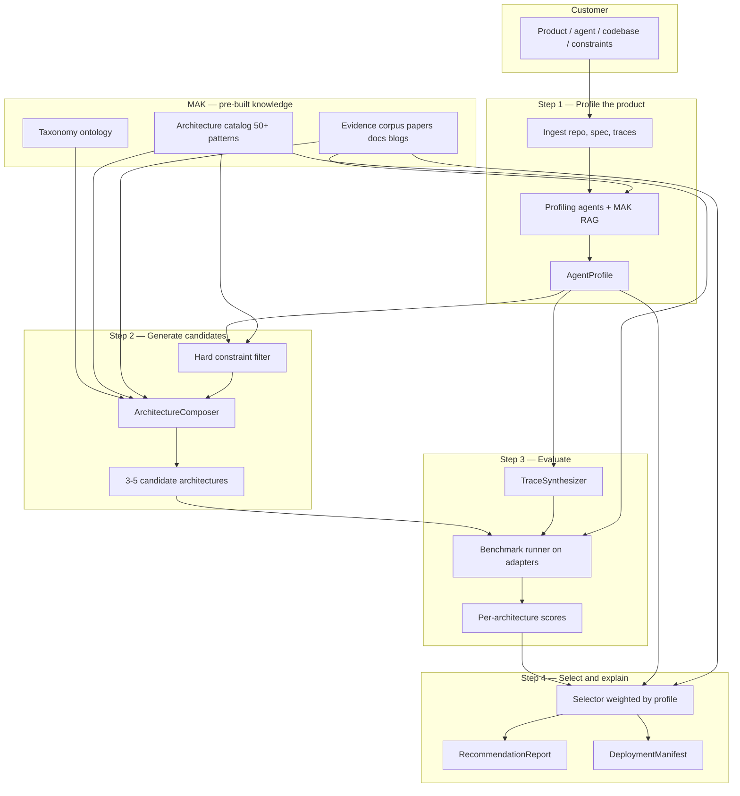
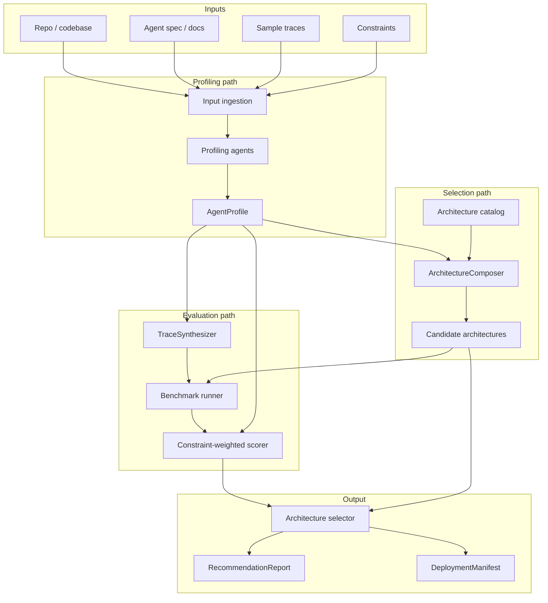

# Part A: Analyze & Recommend — Strategy & Plan

Part A answers one question: **what memory architecture fits this product?**

It profiles the customer's product/agent/codebase, evaluates candidate architectures, and outputs a ranked, explainable recommendation plus a `DeploymentManifest` for Part B.

This document covers strategy, build order, and open design decisions.

**Related:** [Memory Architecture Knowledge Base (MAK)](memory-knowledge.md) — how Membrane ingests papers, docs, and blogs into a structured catalog + evidence corpus that powers recommendations.

---

## How MAK → best architecture (end-to-end)

MAK is the **brain**. Part A is the **decision pipeline** that uses it. Here is how a customer's product becomes a recommendation:



### The five steps in plain language

| Step | What happens | How MAK is used |
|---|---|---|
| **1. Profile** | Understand the customer's product | RAG retrieves relevant papers/docs while profiling ("cyber agents need causal graphs — see MAGMA, Graphiti docs") |
| **2. Compose** | Narrow 50+ patterns → 3–5 candidates | Catalog taxonomy filter + memory-need coverage + RAG comparison |
| **3. Evaluate** | Measure candidates on benchmarks | `eval_affinities` per pattern; `reported_metrics` as priors; synthetic traces from profile |
| **4. Select** | Rank by quality + constraints | Weighted scoring from profile; cross-source citations in report |
| **5. Deploy handoff** | Emit manifest for Part B | Winner's catalog entry → `DeploymentManifest` |

**MAK alone does not pick the winner.** It narrows the search space and provides evidence. **Eval on the customer's profile** picks the winner.

### Step 1 — Profile the product (with MAK context)

Customer calls `POST /v1/analyze` with repo, spec, constraints.

Profiling agents (LLM) produce `AgentProfile`:

```yaml
product_type: cybersecurity_agent
memory_needs: [temporal, entity, causal, audit]
query_patterns: [temporal_reasoning, causal_chains, entity_traversal]
data_modalities: [structured_events, logs, alerts]
constraints:
  latency_p99_ms: 200
  privacy: on_prem
  explainability: required
scale:
  events_per_day: 50000
```

**MAK role:** Before/during profiling, retrieve from corpus:

```
Query: "memory architecture for security agent event logs causal reasoning on-prem"
→ Returns: MAGMA paper chunks, Graphiti docs, audit log patterns, LoCoMo temporal benchmarks
→ Profiling agent uses this to fill memory_needs and query_patterns accurately
```

Without MAK, the profiler guesses. With MAK, it grounds claims in the field's knowledge.

### Step 2 — Generate candidates (catalog + MAK)

`ArchitectureComposer` runs three passes:

**Pass A — Hard filter (catalog)**

```python
# Eliminate impossible architectures
candidates = catalog.all_patterns()
candidates = [p for p in candidates if p.meets_privacy(profile.constraints.privacy)]
candidates = [p for p in candidates if p.latency_profile fits profile.constraints.latency_p99_ms]
candidates = [p for p in candidates if p.covers_required_compliance(profile.constraints.compliance)]
# e.g. 52 patterns → 18 survivors
```

**Pass B — Memory-need coverage (catalog + taxonomy)**

```python
# Score survivors by how well they cover profile.memory_needs
scored = [(p, coverage_score(p, profile.memory_needs)) for p in candidates]
# temporal_graph covers temporal; vector_rag alone scores low on causal
top = scored[:10]
```

**Pass C — RAG enrichment + composition (corpus)**

```python
# Retrieve comparative evidence from MAK
context = mak.search(
  f"best memory architecture for {profile.product_type} "
  f"needs {profile.memory_needs} constraints {profile.constraints}"
)
# LLM composes 3-5 hybrid candidates from top patterns + context
# e.g. ["vector_rag", "temporal_graph", "multi_graph_hybrid", "cybersecurity_recipe"]
```

`cybersecurity_recipe` might be a catalog recipe: `TemporalGraph + EntityGraph + CausalGraph + AuditProvenance`.

**Output:** 3–5 candidates, always including a baseline (`vector_rag`) to beat.

### Step 3 — Evaluate (prove it, don't guess)

For each candidate, run the eval harness:

**Eval corpus** (two sources):
1. **Profile-weighted standard benchmarks** — LoCoMo temporal questions if profile needs temporal; LongMemEval if long-horizon
2. **Synthetic traces** — TraceSynthesizer generates security incident Q&A from profile + optional customer traces

**Run:**

```python
for arch in candidates:
    adapter = load_adapter(arch.implementation.reference_impl)
    adapter.ingest(eval_corpus.events)
    results = adapter.run_queries(eval_corpus.questions)
    scores[arch.id] = judge(results, eval_corpus.ground_truth)
    scores[arch.id].latency = measure_p99(adapter)
    scores[arch.id].cost = estimate_cost(arch, profile.scale)
```

**MAK role in eval:**
- `catalog[pattern].eval_affinities` → which benchmark suites to run
- `catalog[pattern].reported_metrics` → priors ("paper claims 0.70 LoCoMo temporal — verify or override")
- Corpus → judge context for edge cases

**Example scores (cybersecurity profile):**

| Architecture | Temporal | Causal | Semantic | p99 ms | Overall |
|---|---|---|---|---|---|
| vector_rag | 0.22 | 0.18 | 0.71 | 45 | 0.41 |
| temporal_graph | 0.78 | 0.35 | 0.55 | 120 | 0.62 |
| multi_graph_hybrid | 0.91 | 0.89 | 0.68 | 180 | **0.87** |
| mem0_universal | 0.31 | 0.24 | 0.74 | 60 | 0.48 |

### Step 4 — Select and explain

Weighted scoring from profile constraints:

```python
weights = derive_weights(profile)
# cyber + explainability required → high weight on causal, temporal, explainability
# latency_p99 200ms → penalize multi_graph if p99=180 borderline vs vector at 45ms

final = weighted_score(scores, weights)
winner = max(final, key=final.get)
```

**RecommendationReport** cites MAK + eval:

```markdown
## Winner: multi_graph_hybrid

Scores 0.87 overall on your cybersecurity profile eval.

**Why it won:**
- Causal reasoning: 0.89 vs 0.18 (vector_rag) — decisive for incident root-cause queries
- Temporal: 0.91 vs 0.22 (vector_rag)
- Meets explainability requirement via graph traversal paths

**Tradeoffs:**
- p99 180ms — within your 200ms budget but 4x slower than vector_rag
- Requires graph_db + vector_db (see DeploymentManifest)

**Evidence:**
- MAGMA (ACL 2026): multi-graph design for temporal+causal agent memory
- Graphiti docs: production temporal graphs for agents
- Membrane eval: synthetic security incident corpus, 120 questions

**Runner-up:** temporal_graph (0.62) — simpler, consider if causal eval less critical
```

**DeploymentManifest** auto-generated from winner's catalog entry.

### What if MAK is empty / early stage?

Phased fallback:

| MAK maturity | Selection behavior |
|---|---|
| Bootstrap (10 hand-seeded patterns) | Rule-based compose + eval |
| Corpus growing (50+ patterns, partial index) | RAG assists compose; eval is primary |
| Full MAK (catalog + corpus + sync) | Full pipeline above |

Eval on the customer's profile is always the final judge. MAK makes profiling and candidate generation smarter; eval makes the recommendation credible.

---



---

## The core loop

Every analyze job runs the same loop:

1. **Ingest** customer material → normalized `AnalyzeRequest`
2. **Profile** → structured `AgentProfile`
3. **Compose** → 3–5 candidate architecture compositions from catalog
4. **Evaluate** → score each candidate on benchmarks + constraints
5. **Select** → rank, explain winner, emit `DeploymentManifest`

The moat is step 4. Anyone can guess architecture from product type. Membrane **proves** it with eval.

---

## Sub-parts and responsibilities

| ID | Component | Input | Output | Depends on |
|---|---|---|---|---|
| A.1 | Input ingestion | Raw customer material | `AnalyzeRequest` | — |
| A.2 | Profiling agents | `AnalyzeRequest` | `AgentProfile` draft | A.1 |
| A.3 | AgentProfile schema | — | Validated profile contract | — |
| A.4 | Architecture catalog | — | Pattern registry + composer rules | — |
| A.5 | Evaluation engine | Profile + candidates | Per-architecture scores | A.3, A.4, adapters |
| A.6 | Selector & reporter | Scores + profile | `RecommendationReport`, `DeploymentManifest` | A.5 |

---

## Strategy 1: Build order (recommended)

Build credibility bottom-up. Do not start with profiling agents — start with the **judging system** on hand-written profiles.

### Phase A0 — Contracts (week 1)

**Goal:** Define the language Part A speaks.

Deliverables:
- `AgentProfile` Pydantic schema
- `AnalyzeRequest`, `RecommendationReport`, `DeploymentManifest` schemas
- Architecture catalog YAML (~8–11 patterns)
- `examples/cybersecurity/profile.yaml` (hand-written, from Blackstone domain knowledge)

Why first: Everything else reads/writes these artifacts. Part B can build against `DeploymentManifest` in parallel.

### Phase A1 — Rule-based recommender (week 1–2)

**Goal:** Prove selection logic without eval infra.

How it works:
1. Load `AgentProfile`
2. `ArchitectureComposer` proposes candidates from catalog using:
   - Product-type priors (cybersecurity → multi-graph hybrid)
   - Memory-need tags (temporal, causal, audit → require matching patterns)
   - Hard constraint filters (on_prem, latency_p99, compliance)
3. Score candidates with **affinity weights** from catalog (not benchmark runs yet)
4. Output ranked list + explanation

```python
# Pseudocode — Phase A1 scoring
score = (
    w_need * pattern.memory_need_coverage(profile.memory_needs)
  + w_query * pattern.query_pattern_match(profile.query_patterns)
  + w_constraint * constraint_satisfaction(profile.constraints, pattern)
)
```

Standalone value: `membrane recommend --profile examples/cybersecurity/profile.yaml` → sensible ranking with explainable reasoning.

### Phase A2 — Eval harness (week 2–4)

**Goal:** Replace affinity guessing with measured scores.

Components:
- `MemoryBackend` adapter interface (shared with Part B)
- Benchmark runner: ingest → query → judge pipeline
- Constraint stress tests (latency, memory growth)
- LLM-as-judge with fixed prompts (reproducibility matters — see MemEval, Hindsight protocols)

**Benchmark strategy (layered):**

| Layer | Source | When used |
|---|---|---|
| Standard suites | LoCoMo, LongMemEval subsets | General reasoning types (temporal, multi-hop) |
| Profile-weighted categories | Filter benchmark questions by profile query patterns | Cybersecurity profile weights temporal + causal heavily |
| Synthetic traces | TraceSynthesizer from profile + codebase | Domain-specific eval (security incidents, code changes) |
| Customer traces | Optional upload | Highest fidelity, post-MVP |

**Important:** LoCoMo is conversational QA — a weak proxy for cybersecurity event graphs. Plan a **domain eval pack** for security (incident timeline, causal chain, entity attribution questions) alongside standard benchmarks.

Initial adapters to eval (minimal, can live in Part A or shared `adapters/`):
- `vector_rag_lite` — baseline everyone loses to on temporal/causal
- `temporal_graph_lite` — proves graph wins on temporal queries
- `multi_graph_lite` — hybrid winner on cybersecurity profile

### Phase A3 — Profiling agents (week 4–6)

**Goal:** Automate `AgentProfile` generation from customer inputs.

**Recommended approach: static analysis + LLM synthesis**

```
Repo ──► Static extractors ──► Evidence bundle ──► LLM ──► AgentProfile
              │                                      ▲
Spec/docs ────┴──────────────────────────────────────┘
Constraints ──────────────────────────────────────────┘
```

Static extractors (language-agnostic where possible):
- Directory structure, entry points, README
- Data models (SQLAlchemy, Pydantic, Prisma schemas)
- Event/log patterns (Kafka, webhooks, audit tables)
- Existing memory usage (vector DB imports, Redis, graph DB clients)
- API routes and agent tool definitions

LLM role: synthesize evidence → structured `AgentProfile`, cite sources, flag uncertainties.

Agents:
| Agent | Static input | LLM output fields |
|---|---|---|
| CodebaseAnalyzer | AST, imports, schemas, infra deps | data_modalities, memory_needs, scale signals, existing_memory |
| ProductSpecAgent | README, docs, agent spec | product_type, query_patterns, user journeys |
| ConstraintExtractor | Config, natural language requirements | constraints block |
| TraceSynthesizer | Profile + codebase context | synthetic eval corpus |

Human-in-the-loop: profile is reviewable/editable before eval runs. Enterprise customers will want this.

### Phase A4 — Full pipeline + API (week 6–8)

- `POST /v1/analyze` async job orchestrator
- Clarifying questions when profile confidence is low
- `GET /v1/jobs/{id}/report` — markdown recommendation report
- CLI: `membrane analyze --repo URL --constraints constraints.yaml`

---

## Strategy 2: Profiling approaches (tradeoffs)

### Option A: LLM-only profiling

Feed repo tree, docs, spec to an LLM with structured output schema.

| Pros | Cons |
|---|---|
| Fast to build | Hallucinates memory needs |
| Works on any repo | No evidence citations |
| | Hard to debug wrong profiles |

### Option B: Static analysis + LLM synthesis (recommended)

Extract structured facts first; LLM maps facts → `AgentProfile`.

| Pros | Cons |
|---|---|
| Grounded, citeable evidence | Per-language extractors take time |
| Explainable ("found audit_log table → audit need") | Falls back to LLM-only for unsupported langs |
| Matches how good architecture tools work (Ridge, AgenticCodebase) | |

### Option C: Questionnaire + LLM

Structured intake form: product type, latency budget, compliance, data types. Optional repo analysis enriches.

| Pros | Cons |
|---|---|
| High trust, low hallucination | Less "one API magic" |
| Works without repo access | More friction for developers |
| Good for enterprise sales | |

**Recommendation:** B as default, C as fallback when repo access is unavailable, A only for v0 prototyping.

---

## Strategy 3: Evaluation approaches (tradeoffs)

### Option A: Profile-only / rule-based (Phase A1)

Catalog affinity + constraint filtering. No benchmark runs.

| Pros | Cons |
|---|---|
| Ships in days | Not differentiated — "smart defaults" |
| No adapter infra needed | Competitors can copy the table |

### Option B: Phased eval (recommended)

1. Rule-based candidates (narrow search space)
2. Real benchmark runs on 3–5 candidates
3. Customer traces later

| Pros | Cons |
|---|---|
| Credible, reproducible scores | Needs thin adapters early |
| Standard suites enable comparison vs Mem0/Zep | Eval cost (LLM judge API calls) |
| Explainable per-category breakdown | |

### Option C: Real backends from day one

Full adapter implementations before any profiling.

| Pros | Cons |
|---|---|
| Maximum credibility | Slowest path to Part A MVP |
| | Heavy Part B dependency |

**Recommendation:** Phased eval (B). Phase A1 rule-based recommender is the bootstrap; Phase A2 eval is the moat.

---

## Strategy 4: ArchitectureComposer

How to go from `AgentProfile` → candidate architectures.

### Step 1: Hard constraint filtering

Eliminate architectures that violate non-negotiables:

```
if profile.constraints.privacy == "on_prem":
    exclude patterns requiring managed cloud-only services

if profile.constraints.latency_p99_ms < 300:
    exclude patterns without cache/fast-path component

if "audit_log" in profile.constraints.compliance:
    require AuditProvenance pattern in composition
```

### Step 2: Memory-need coverage scoring

Each catalog pattern tags which `memory_needs` it satisfies:

```yaml
# catalog/patterns/temporal_graph.yaml
memory_needs: [temporal, episodic]
query_patterns: [temporal_reasoning, event_sequence]
```

Score = fraction of profile needs covered by the composition.

### Step 3: Generate 3–5 compositions

| Strategy | Description |
|---|---|
| **Single best** | Top-scoring monolithic pattern |
| **Greedy compose** | Add patterns until all memory_needs covered |
| **Catalog recipes** | Pre-defined hybrids per product_type (cybersecurity recipe) |
| **Always include baseline** | vector_rag as floor comparison in every eval run |

Output: `["vector_rag", "temporal_graph", "multi_graph_hybrid", "cybersecurity_recipe"]`

### Step 4: Eval replaces affinity scores

Phase A2 runs benchmarks; affinity scores become priors, not final rankings.

---

## Strategy 5: Scoring engine

Multi-objective scoring with constraint-weighted aggregation.

### Metric categories

| Category | Metrics | Profile weight driver |
|---|---|---|
| Retrieval quality | Recall@k, LLM-judge accuracy | Always |
| Reasoning | Temporal, causal, multi-hop accuracy | `query_patterns` |
| Performance | p50/p99 latency, write throughput | `constraints.latency_*`, `scale` |
| Cost | Cost per 1M queries, storage growth | `constraints.budget_*` |
| Compliance | Audit completeness, tenant isolation | `constraints.compliance` |
| Explainability | Retrieval path available | `constraints.explainability` |

### Scoring formula

```python
def score(architecture, profile, eval_results):
    weights = derive_weights(profile)  # e.g. cyber → high temporal/causal weight

    quality = weighted_mean(eval_results.category_scores, weights)
    performance = constraint_fit(eval_results.latency, profile.constraints)
    cost = constraint_fit(eval_results.cost, profile.constraints)

    # Hard constraint violation → disqualify or heavy penalty
    if violates_hard_constraints(architecture, profile):
        return DISQUALIFIED

    return (
        0.55 * quality
      + 0.25 * performance
      + 0.20 * cost
    )
```

### Explainability requirement

Every recommendation must include:
- Per-architecture scores broken down by category
- Why winner beat runner-up (specific metric deltas)
- Tradeoffs ("multi_graph wins on causal +0.46 but costs 2.3x more")
- Confidence level (based on eval corpus size and profile extraction confidence)

---

## Strategy 6: Synthetic trace generation

Generic benchmarks (LoCoMo) miss domain-specific needs. TraceSynthesizer closes the gap.

### Inputs
- `AgentProfile`
- Codebase evidence (API routes, event schemas, sample logs)
- Optional customer traces

### Outputs
- `EvalCorpus`: list of `{context_events, query, expected_answer, reasoning_type}`

### Generation strategies

| Strategy | Use case |
|---|---|
| **Template-based** | Cybersecurity: incident timeline templates with injected entities |
| **LLM-generated from spec** | Chatbot: multi-session conversations from product description |
| **Perturbation of real traces** | Customer provided 10 traces → generate 100 variants |
| **Adversarial** | Near-miss queries that fool vector-only retrieval |

### Validation
- Human review sample (10%) for ground truth quality
- LoCoMo audit showed 6.4% wrong answer keys — invest in validation pipeline
- Use strict judge prompts; report judge model + prompt in results

---

## Strategy 7: Cybersecurity as first vertical

Your Blackstone experience makes cybersecurity the right first eval vertical.

### Hand-written profile (`examples/cybersecurity/profile.yaml`)

```yaml
product_type: cybersecurity_agent
memory_needs:
  - temporal
  - entity
  - causal
  - audit
data_modalities:
  - structured_events
  - logs
  - alerts
query_patterns:
  - temporal_reasoning
  - causal_chains
  - entity_traversal
  - provenance_lookup
constraints:
  latency_p99_ms: 200
  privacy: on_prem
  compliance: [audit_log, SOC2]
  explainability: required
scale:
  events_per_day: 50000
  retention_days: 365
```

### Custom eval pack (not just LoCoMo)

| Question type | Example | Tests |
|---|---|---|
| Timeline | "What happened between alert X and containment Y?" | TemporalGraph |
| Causal | "What caused the lateral movement?" | CausalGraph |
| Entity | "Which assets did host A communicate with?" | EntityGraph |
| Provenance | "Who approved rule change Z and when?" | AuditProvenance |
| Semantic | "Find similar incidents to this phishing attempt" | VectorRAG |

Expected result: `vector_rag` scores high on semantic only; `multi_graph_hybrid` wins overall.

---

## Strategy 8: Benchmark hygiene

Learn from MemEval and LoCoMo audits:

1. **Disclose full eval pipeline** — ingestion prompt, embedding model, judge model, judge prompt, number of runs
2. **Per-category breakdown** — not just aggregate score (LongMemEval: SS-U, Temp, MS, K-Update, etc.)
3. **Fixed judge protocol** — use a published prompt (e.g. Hindsight's) for comparability
4. **Validate ground truth** — sample and audit synthetic corpus
5. **Always include baselines** — full context, vector-only, naive RAG
6. **Report confidence intervals** — multiple runs where stochastic

---

## AgentProfile schema (draft)

```python
class AgentProfile(BaseModel):
    product_type: ProductType  # enum: chatbot, cybersecurity_agent, codebase_agent, ...
    memory_needs: list[MemoryNeed]  # temporal, entity, causal, audit, episodic, ...
    data_modalities: list[DataModality]  # text, code, logs, structured_events, ...
    query_patterns: list[QueryPattern]  # temporal_reasoning, similarity_lookup, ...
    constraints: Constraints
    scale: Scale
    evidence: list[Evidence]  # citations from profiling agents
    confidence: float  # 0-1, how complete/reliable the profile is
```

`Evidence` links profile fields to source (`file:line`, `doc section`, `user input`) — critical for trust.

---

## Part A API design

### `POST /v1/analyze`

```json
{
  "source": {
    "type": "github_repo",
    "url": "https://github.com/org/security-agent",
    "branch": "main"
  },
  "spec": {
    "description": "SOC analyst copilot for alert triage",
    "agent_type": "active_agent"
  },
  "constraints": {
    "latency_p99_ms": 200,
    "privacy": "on_prem",
    "budget_monthly_usd": 500,
    "compliance": ["audit_log"]
  },
  "options": {
    "skip_profiling": false,
    "profile_override": null,
    "eval_depth": "standard"
  }
}
```

### Job states

```
pending → profiling → composing → evaluating → selecting → complete
                      ↘ failed (with partial results)
                      ↘ needs_clarification (low confidence fields)
```

### `GET /v1/jobs/{id}` response (complete)

```json
{
  "status": "complete",
  "agent_profile": { },
  "candidates": ["vector_rag", "temporal_graph", "multi_graph_hybrid"],
  "scores": {
    "vector_rag": { "overall": 0.41, "temporal": 0.22, "causal": 0.18 },
    "multi_graph_hybrid": { "overall": 0.87, "temporal": 0.91, "causal": 0.89 }
  },
  "recommendation": {
    "winner": "multi_graph_hybrid",
    "explanation": "...",
    "tradeoffs": "..."
  },
  "deployment_manifest": { }
}
```

---

## Repo layout (Part A)

```
membrane/
├── analyze/
│   ├── ingest/           # A.1
│   ├── agents/           # A.2
│   ├── profile/          # A.3
│   ├── catalog/          # A.4 — composer logic
│   ├── eval/             # A.5
│   │   ├── runner.py
│   │   ├── scorer.py
│   │   ├── judge.py
│   │   └── suites/
│   │       ├── locomo/
│   │       ├── longmemeval/
│   │       └── cybersecurity/
│   └── select/           # A.6
├── schemas/
│   ├── agent_profile.py
│   ├── analyze_request.py
│   └── recommendation.py
├── catalog/              # YAML pattern definitions
│   └── patterns/
├── benchmarks/
└── examples/
    └── cybersecurity/
        ├── profile.yaml
        └── eval_corpus.jsonl
```

---

## Dependencies on Part B

| Part A needs | From Part B | Workaround for Part A MVP |
|---|---|---|
| Runnable memory backends | Adapter implementations | Ship `*_lite` adapters in shared `adapters/` |
| DeploymentManifest validation | Part B manifest parser | Schema-only validation in Part A |
| Production eval at scale | Hosted infra | Local Docker eval runner |

**Minimize coupling:** `MemoryBackend` interface lives in `membrane/schemas/` or `membrane/adapters/base.py` — shared package, not owned by Part B.

---

## Risks

| Risk | Mitigation |
|---|---|
| Profiling hallucinates memory needs | Evidence citations + human review step + confidence scores |
| LoCoMo doesn't predict production quality | Domain eval packs + customer traces + continuous re-eval (Part B → A) |
| Eval too expensive/slow | Stratified sampling, cache eval results, `eval_depth: quick | standard | thorough` |
| Wrong architecture recommended | Always show tradeoffs; let customer override; log eval corpus for audit |
| Catalog becomes stale | Version catalog; community contributions; research pattern imports (MAGMA, MemVerse) |

---

## Decisions (from planning discussion)

| Decision | Choice | Implication |
|---|---|---|
| **Profiling** | LLM-only | Feed repo tree, docs, spec, constraints to agents with structured output → `AgentProfile`. Fastest path to MVP. Add static extractors later for grounding. |
| **Overall flow** | Integrated analyze → profile → find best architecture | One cohesive pipeline: understand the product first, then recommend. Eval validates the recommendation, not a separate concern. |
| **First vertical** | Cybersecurity (from domain experience) | Hand-written profile + custom eval pack as bootstrap |

### Profiling approach: LLM-only (v1)

```
AnalyzeRequest ──► LLM agents (structured output) ──► AgentProfile
     │                      │
     ├── repo tree/summary  ├── CodebaseAnalyzer
     ├── docs/spec          ├── ProductSpecAgent
     ├── traces             ├── ConstraintExtractor
     └── constraints        └── TraceSynthesizer (for eval corpus)
```

**v1 implementation:**
- Clone repo or accept upload; build a **context bundle** (file tree, key files, README, configs, sample logs)
- Single or multi-agent LLM calls with Pydantic structured output
- `confidence` field per profile section; trigger `needs_clarification` when low
- Evidence field optional in v1 (add file citations in v2 with static analysis)

**Upgrade path:** Layer static extractors (schemas, event patterns, infra deps) as **evidence prep** for the LLM without changing the AgentProfile contract.

---

## Open decisions

---

## Recommended MVP definition

**Part A MVP = Phase A0 + A1 + A2 (cybersecurity vertical only)**

```bash
# Hand-written profile → eval → explainable report
membrane analyze --profile examples/cybersecurity/profile.yaml

# Output:
# 1. Ranked architectures with per-category scores
# 2. Explanation of why multi_graph_hybrid won
# 3. DeploymentManifest ready for Part B
```

Success criteria:
- `vector_rag` ranks last on temporal + causal for cybersecurity profile
- `multi_graph_hybrid` ranks first with explainable metric deltas
- Full eval pipeline disclosed (judge, prompts, adapters)
- Report is readable by a non-expert customer

---

## Next implementation steps

1. `schemas/agent_profile.py` + `catalog/patterns/*.yaml`
2. `examples/cybersecurity/profile.yaml` + `eval_corpus.jsonl`
3. `analyze/catalog/composer.py` — rule-based candidate generation
4. `analyze/select/scorer.py` — affinity scoring (Phase A1)
5. `adapters/base.py` + `vector_rag_lite` + `temporal_graph_lite`
6. `analyze/eval/runner.py` — benchmark pipeline (Phase A2)
7. `analyze/eval/suites/cybersecurity/` — domain eval pack
