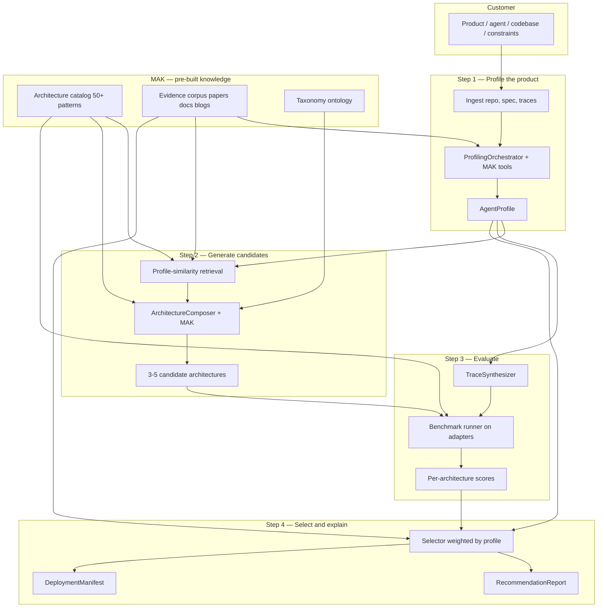
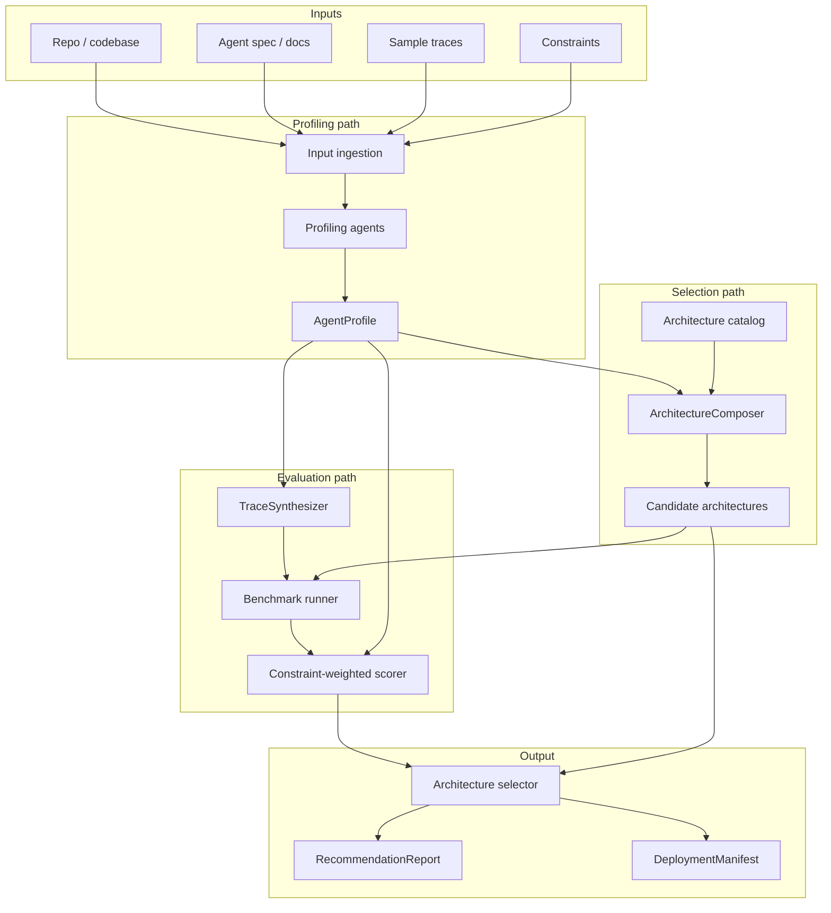
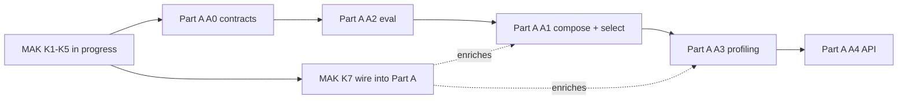
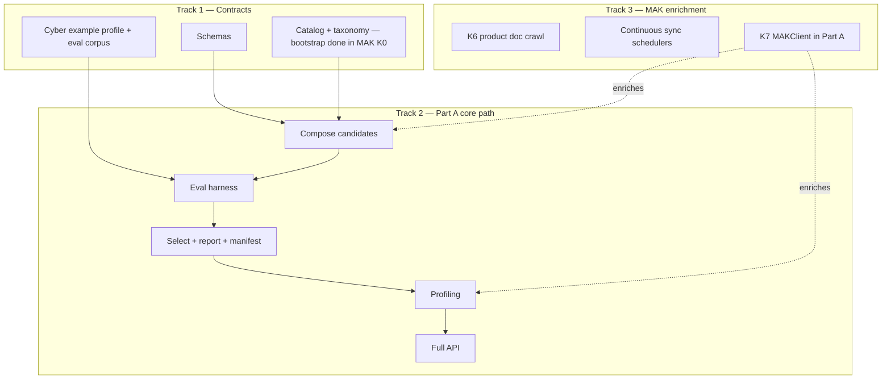

# Part A: Analyze & Recommend — Strategy & Plan

Part A answers one question: **what memory architecture fits this product?**

It profiles the customer's product/agent/codebase, evaluates candidate architectures, and outputs a ranked, explainable recommendation plus a `DeploymentManifest` for Part B.

This document covers strategy, build order, and open design decisions.

**Related:** [Memory Architecture Knowledge Base (MAK)](memory-knowledge.md) — how Membrane ingests papers, docs, and blogs into a structured catalog + evidence corpus that powers recommendations.

**Profiling deep dive:** [profiling.md](profiling.md) — how we build `AgentProfile` from a codebase and/or product website.

---

## How MAK → best architecture (end-to-end)

MAK is the **brain**. Part A is the **decision pipeline** that uses it. Here is how a customer's product becomes a recommendation:



### The five steps in plain language

| Step | What happens | How MAK is used |
|---|---|---|
| **1. Profile** | Understand the customer's product | **Agentic MAK retrieval** — agents call `mak_search` / `mak_compare` while analyzing codebase + website ([profiling.md](profiling.md)) |
| **2. Compose** | Narrow 50+ patterns → 3–5 candidates (monoliths + hybrids) | Profile-similarity + **agentic KB queries** + greedy/LLM composition |
| **3. Evaluate** | Measure candidates on benchmarks | `eval_affinities` per pattern; `reported_metrics` as priors; synthetic traces from profile |
| **4. Select** | Rank by quality + constraints | Weighted scoring from profile; cross-source citations in report |
| **5. Deploy handoff** | Emit manifest for Part B | Winner's catalog entry → `DeploymentManifest` |

**MAK alone does not pick the winner.** It narrows the search space and provides evidence. **Eval on the customer's profile** picks the winner.

### Step 1 — Profile the product (agentic MAK retrieval)

Customer calls `POST /v1/analyze` with repo, spec, constraints.

`ProfilingOrchestrator` seeds an `InvestigationScratchpad` from deterministic bundles, then runs an **iterative tool loop** over MAK while analyzing the product — not a single upfront RAG injection.

```python
result = ProfilingOrchestrator(max_iterations=8).run(ProfilingInput(
    codebase_bundle=codebase_bundle,
    product_bundle=product_bundle,
    stated_constraints=constraints,
))
# result.scratchpad.tool_calls → logged for RecommendationReport
# result.profile → AgentProfile
```

**MAK tools agents call during profiling:**

```
mak_search("temporal graph SOC agent memory")
mak_compare(["vector_rag", "graphiti", "magma_multigraph"], focus="incident correlation")
mak_get_pattern("graphiti")
mak_get_source_section("arxiv_2601_03236", section_path="abstract")
```

**Why agentic, not one-shot RAG:** Profiling is investigative. A codebase signal ("audit_log table, no graph client") should trigger a follow-up search ("causal audit memory patterns") — humans do this naturally.

**Modes:** `agentic` when `MEMBRANE_LLM_API_KEY` is set (LLM chooses tools); `heuristic` offline (rule-triggered searches from bundle signals).

**Eval still picks the winner.** Agents + MAK produce `AgentProfile` and candidates; benchmarks measure them.

Example profile output:

```yaml
product_type: cybersecurity_agent
memory_needs: [temporal, entity, causal, audit]
query_patterns: [temporal_reasoning, causal_chains, entity_traversal]
constraints:
  latency_p99_ms: 200
  privacy: on_prem
  explainability: required
mak_tool_calls:
  - mak_search: "temporal graph agent memory incident correlation"
  - mak_compare: [vector_rag, graphiti, magma_multigraph]
```

See [profiling.md](profiling.md) · `membrane/analyze/orchestrator.py` · `membrane/knowledge/tools.py`

### Step 2 — Generate candidates (no hard filters)

We **do not** use rule-based hard filters (no "disqualify if on-prem"). Constraints are scored dimensions in eval and selection — architectures that poorly fit latency, privacy, or compliance sink in the ranking instead of being removed upfront.

**Candidates are monoliths or composed hybrids.** Membrane does not only pick one catalog pattern — it proposes **memory stacks** built from multiple patterns where the profile needs more than one capability.

| Candidate type | What it is | Example |
|---|---|---|
| **Monolithic** | Single catalog pattern | `vector_rag`, `magma_multigraph` |
| **Hybrid** | Multiple patterns with roles + router | session memory + incident graph + runbook RAG |

`HybridComposer` (see `membrane/catalog/composer.py`) runs four passes:

**Pass A — Profile-similarity retrieval (catalog + MAK)**

```python
query = profile.to_search_query()
retrieved = mak.search(query, top_k=15)
ranked = catalog.rank_by_need_coverage(profile.memory_needs, candidates=retrieved)
```

**Pass B — Greedy need coverage (deterministic hybrid draft)**

```python
hybrid = greedy_compose_hybrid(
    memory_needs=profile.memory_needs,
    query_patterns=profile.query_patterns,
)
# Covers temporal → graphiti, semantic → vector_rag, etc.
# Uses catalog composable_with edges to avoid incompatible pairings
```

**Pass C — LLM + recipe refinement (MAK context)**

```python
context = mak.compare(ranked[:8])
recipe = load_recipe("cybersecurity_soc_stack")  # product-type template when available
candidates = composer_llm(
    profile=profile,
    context=context,
    seeds=[recipe, hybrid, ranked[:3]],
    instruction="Propose 3-5 candidates to benchmark: monoliths AND hybrid stacks. "
                "Each hybrid must list components (role, pattern_id, serves) and a router. "
                "Every component must reference a catalog pattern_id.",
)
```

**Pass D — Diversity check**

Ensure the eval set includes:
- `vector_rag` monolithic baseline (always)
- At least one **profile-composed hybrid**
- At least one strong monolith (e.g. `magma_multigraph` for graph-heavy profiles)
- Optional product-type **recipe** (e.g. `cybersecurity_soc_stack`)

**Output:** 3–5 `ArchitectureCandidate` objects — mix of `MonolithicCandidate` and `HybridArchitecture`.

Example hybrid (cyber SOC):

```yaml
id: cybersecurity_soc_stack
type: hybrid
components:
  - { role: session_memory, pattern_id: mem0_universal, serves: [profile, semantic] }
  - { role: incident_graph, pattern_id: graphiti, serves: [temporal, entity, causal] }
  - { role: runbook_rag, pattern_id: vector_rag, serves: [semantic] }
router:
  type: query_pattern_routing
  rules:
    - { when: [temporal_reasoning, causal_chains], use_role: incident_graph }
    - { when: [similarity_lookup], use_role: runbook_rag }
  default_role: session_memory
```

Schemas: `membrane/schemas/hybrid.py` · Recipe: `catalog/recipes/cybersecurity_soc_stack.yaml`

### Step 3 — Evaluate (prove it, don't guess)

For each candidate — **monolithic or hybrid** — run the eval harness.

**Eval corpus** (two sources):
1. **Profile-weighted standard benchmarks** — LoCoMo temporal questions if profile needs temporal; LongMemEval if long-horizon
2. **Synthetic traces** — TraceSynthesizer generates security incident Q&A from profile + optional customer traces

Questions are tagged with `query_pattern` (e.g. `temporal_reasoning`, `similarity_lookup`) so hybrid routers can be tested fairly.

**Run:**

```python
for candidate in candidates:
    if candidate.type == "monolithic":
        adapter = load_adapter(candidate.pattern_id)
    else:
        adapter = HybridLiteAdapter(candidate)  # routes to vector_rag_lite, temporal_graph_lite, etc.

    adapter.ingest(eval_corpus.events)
    results = adapter.run_queries(eval_corpus.questions)
    scores[candidate.id] = {
        "quality": judge(results, eval_corpus.ground_truth),
        "latency_fit": measure_latency_fit(adapter, profile.constraints),
        "privacy_fit": score_privacy_fit(candidate, profile.constraints),
        "compliance_fit": score_compliance_fit(candidate, profile.constraints),
        "cost_fit": estimate_cost_fit(candidate, profile.scale, profile.constraints),
        # optional per-component breakdown for hybrids
        "component_scores": adapter.per_role_scores() if hybrid else {},
    }
```

For hybrids, `HybridLiteAdapter` routes each eval question to the component role declared in `router.rules`, then aggregates scores — same outward interface as a monolithic adapter.

Constraints are **measured**, not assumed from catalog metadata. A pattern that claims on-prem support but fails isolation tests scores low on `privacy_fit`.

**MAK role in eval:**
- `catalog[pattern].eval_affinities` → which benchmark suites to run
- `catalog[pattern].reported_metrics` → priors ("paper claims 0.70 LoCoMo temporal — verify or override")
- Corpus → judge context for edge cases

**Example scores (cybersecurity profile):**

| Candidate | Type | Quality | Latency fit | Privacy fit | Compliance fit | Overall |
|---|---|---|---|---|---|---|
| vector_rag | monolithic | 0.41 | 0.95 | 0.90 | 0.20 | 0.52 |
| magma_multigraph | monolithic | 0.87 | 0.75 | 0.88 | 0.92 | 0.84 |
| cybersecurity_soc_stack | **hybrid** | 0.85 | 0.82 | 0.86 | 0.90 | **0.86** |
| mem0_universal | monolithic | 0.48 | 0.88 | 0.40 | 0.30 | 0.45 |

A composed stack can **match or beat** a research monolith by assigning each query pattern to the right component — eval proves it, not the composer alone.

`mem0_universal` stays in the race — it scores well on latency but tanks on privacy/compliance fit for this profile. The report explains that, rather than hiding it behind a filter.

### Step 4 — Select and explain

Weighted scoring — profile constraints set the weights, not binary gates:

```python
weights = derive_weights(profile)
# cyber profile → high weight on quality (causal/temporal) + compliance_fit
# latency_p99 200ms → latency_fit weighted heavily but 0.75 still competes

overall = (
    weights.quality * scores.quality
  + weights.latency * scores.latency_fit
  + weights.privacy * scores.privacy_fit
  + weights.compliance * scores.compliance_fit
  + weights.cost * scores.cost_fit
)
```

No disqualification. Low constraint fit → low overall → ranked down + called out in report.

**RecommendationReport** cites MAK + eval:

```markdown
## Winner: cybersecurity_soc_stack (hybrid)

Scores 0.86 overall on your cybersecurity profile eval.

**Stack:**
| Role | Pattern | Serves |
|---|---|---|
| session_memory | mem0_universal | profile, semantic |
| incident_graph | graphiti | temporal, entity, causal |
| runbook_rag | vector_rag | semantic / runbooks |

**Why it won:**
- Routed temporal/causal questions to graphiti — 0.89 vs 0.18 (vector_rag alone)
- Kept runbook lookup on vector RAG — fast, sufficient for similarity queries
- Session memory handles profile recall without overloading the graph

**Tradeoffs:**
- Three components vs one — higher ops complexity (see DeploymentManifest)
- p99 165ms — within 200ms budget; faster than monolithic multi-graph on simple queries

**Evidence:**
- Graphiti docs: production temporal graphs for agents
- Mem0 docs: session-scoped memory API patterns
- Membrane eval: 120-question synthetic SOC corpus with query_pattern routing

**Runner-up:** magma_multigraph (0.84) — simpler deploy, consider if you want one vendor/stack
```

**DeploymentManifest** describes the full stack for Part B — one unified Memory API outward, router inward:

```yaml
deployment:
  type: hybrid
  unified_api: true
  router:
    type: query_pattern_routing
    default_role: session_memory
    rules: [...]
  components:
    - { id: session_memory, pattern_id: mem0_universal, adapter: adapters.mem0 }
    - { id: incident_graph, pattern_id: graphiti, adapter: adapters.graphiti }
    - { id: runbook_rag, pattern_id: vector_rag, adapter: adapters.vector_rag }
```

Schema: `membrane/schemas/manifest.py` · `hybrid_to_manifest()` in `catalog/composer.py`

### What if MAK is empty / early stage?

Phased fallback:

| MAK maturity | Selection behavior |
|---|---|
| Bootstrap (10 hand-seeded patterns) | Rule-based compose + eval |
| Corpus growing (50+ patterns, partial index) | RAG assists compose; eval is primary |
| Full MAK (catalog + corpus + sync) | Full pipeline above |

Eval on the customer's profile is always the final judge. MAK makes profiling and candidate generation smarter; eval makes the recommendation credible.

---



---

## The core loop

Every analyze job runs the same loop:

1. **Ingest** customer material → normalized `AnalyzeRequest`
2. **Profile** → structured `AgentProfile`
3. **Compose** → 3–5 candidate architecture compositions from catalog
4. **Evaluate** → score each candidate on benchmarks + constraints
5. **Select** → rank, explain winner, emit `DeploymentManifest`

The moat is step 4. Anyone can guess architecture from product type. Membrane **proves** it with eval.

---

## Sub-parts and responsibilities

| ID | Component | Input | Output | Depends on |
|---|---|---|---|---|
| A.1 | Input ingestion | Raw customer material | `AnalyzeRequest` | — |
| A.2 | Profiling agents | `AnalyzeRequest` | `AgentProfile` draft | A.1 |
| A.3 | AgentProfile schema | — | Validated profile contract | — |
| A.4 | Architecture catalog | — | Pattern registry + composer rules | — |
| A.5 | Evaluation engine | Profile + candidates | Per-architecture scores | A.3, A.4, adapters |
| A.6 | Selector & reporter | Scores + profile | `RecommendationReport`, `DeploymentManifest` | A.5 |

---

---

## Part A building strategy

> **Current priority (2025):** Build MAK K1–K5 first. Part A milestones below resume after the knowledge base is queryable. See [memory-knowledge.md](memory-knowledge.md) and `membrane knowledge --help`.

How we build Part A — principles, tracks, milestones, and what to ship when **after MAK K5 is done**.

### Core principles

| Principle | What it means |
|---|---|
| **MAK-first** | Ship fetch → sync → extract → index → search before eval or profiling. Recommendations need evidence. |
| **Eval proves the moat** | Once MAK is queryable, build the judging system before profiling agents. |
| **Vertical slice** | Cybersecurity end-to-end first. One domain done well beats three domains half-built. |
| **Hand-written profile bootstrap** | `examples/cybersecurity/profile.yaml` unblocks compose + eval while profiling is in progress. |
| **Thin adapters early** | `vector_rag_lite`, `temporal_graph_lite`, `multi_graph_lite` — minimal but real enough to benchmark. |
| **Every phase demoable** | Each milestone has a CLI command that produces visible output. |
| **No hard filters** | Constraint-fit scoring in eval from day one, not rule-based elimination. |

### Build order (current)



**Now:** MAK K1–K5 (`membrane knowledge sync|fetch|extract|index|search`).  
**Next:** Part A contracts + eval harness, then compose/select, profiling, API.  
**Then:** MAK K7 wires `MAKClient` into compose + profiling agents.

### Three tracks (after MAK K5)



**Track 1** blocks Part A. **Track 2** is the Part A critical path. **Track 3** continues MAK growth and wires retrieval into Part A (K7).

### Build phases (sequential within Track 2)

#### Milestone 1 — Contracts (A0)

**Ship:** The language Part A speaks.

```
membrane/
├── schemas/           agent_profile, analyze_request, recommendation, deployment_manifest
├── catalog/
│   ├── taxonomy.yaml
│   └── patterns/      8-10 hand-seeded YAML patterns
└── examples/cybersecurity/
    ├── profile.yaml   hand-written from domain knowledge
    └── eval_corpus.jsonl
```

**Demo:** Load and validate schemas + example files.

**Effort:** Small. Do this first.

---

#### Milestone 2 — Eval harness (A2) ← build before compose polish

**Why eval before profiling:** Proves the moat. You can run `profile.yaml` → scores → report without any LLM profiling or MAK.

**Ship:**
- `adapters/base.py` — `write`, `query`, `benchmark` interface
- `adapters/vector_rag_lite.py` — baseline
- `adapters/temporal_graph_lite.py` — graph baseline
- `adapters/multi_graph_lite.py` — hybrid (cyber winner)
- `analyze/eval/runner.py` — ingest → query → judge
- `analyze/eval/scorer.py` — quality + latency_fit + privacy_fit + compliance_fit + cost_fit
- `analyze/eval/suites/cybersecurity/` — domain eval pack (~50-120 questions)
- `analyze/eval/judge.py` — fixed LLM-as-judge protocol

**Demo:**
```bash
membrane eval --profile examples/cybersecurity/profile.yaml \
  --candidates vector_rag,multi_graph_hybrid
```

**Success criteria:**
- `multi_graph_hybrid` beats `vector_rag` on quality + compliance_fit for cyber profile
- Scores are reproducible (disclosed judge + prompts)
- Constraint dimensions appear in output

---

#### Milestone 3 — Compose + select (A1 + A6)

**Ship:**
- `analyze/catalog/composer.py` — profile-similarity retrieval + 3-5 candidate selection
- `analyze/select/selector.py` — weighted scoring from eval results
- `analyze/select/reporter.py` — markdown RecommendationReport
- `analyze/select/manifest.py` — DeploymentManifest from winner catalog entry

**Demo:**
```bash
membrane recommend --profile examples/cybersecurity/profile.yaml
# → ranked list + report + deployment_manifest.yaml
```

**Note:** Milestone 2 + 3 together = **Part A MVP**.

```bash
membrane analyze --profile examples/cybersecurity/profile.yaml
```

---

#### Milestone 4 — Profiling (A3)

**Ship:** [profiling.md](profiling.md) design — public GitHub + website only.

```
analyze/profile/
├── collect/
│   ├── codebase_bundle.py    shallow clone, memory signals, file select
│   └── product_surface.py    website crawler
├── agents/
│   ├── product_surface.py
│   ├── codebase.py
│   ├── memory_inference.py
│   └── constraint_merger.py
└── merge.py                  → AgentProfile
```

**Demo:**
```bash
membrane profile --repo https://github.com/org/soc-agent --url https://org.com/product
membrane analyze --repo ... --url ...   # full pipeline, no hand-written profile
```

**Depends on:** Milestone 3 working. MAK optional (agents work without it, better with it).

---

#### Milestone 5 — API + orchestration (A4)

**Ship:**
- `analyze/api/` — FastAPI `POST /v1/analyze`, `GET /v1/jobs/{id}`
- Job states: `profiling → composing → evaluating → selecting → complete`
- `needs_clarification` when profile confidence low
- CLI mirrors API

**Demo:**
```bash
membrane analyze --repo URL --url URL --constraints constraints.yaml
```

---

#### Milestone 6 — MAK integration (Track 3 → Track 2)

**Ship:** When MAK has index + catalog (see [memory-knowledge.md](memory-knowledge.md) K1–K7):
- `MAKClient.retrieve_for_profile()` in compose
- `MAKClient` context in profiling agents
- Citations from corpus in reports

**Not blocking** Milestones 1–5.

### What we deliberately defer

| Deferred | Why |
|---|---|
| Private GitHub repos | Public only v1 |
| LoCoMo / LongMemEval full integration | Cyber domain pack first; add standard suites after |
| TraceSynthesizer (LLM-generated eval) | Hand-written `eval_corpus.jsonl` first |
| HTTP API / hosted service | CLI + local first |
| All 50+ catalog patterns | 8–10 hand-seeded, MAK grows the rest |
| Part B adapters in production | `*_lite` stubs sufficient for eval |

### Team-of-one vs parallel work

**Solo developer order (updated):**
1. ~~MAK K1–K5~~ (in progress / done)
2. Part A A0 contracts
3. Part A A2 eval (cyber pack + 3 adapters)
4. Part A A1/A6 compose + select + report
5. Part A A3 profiling
6. Part A A4 API
7. MAK K6–K7 + wire into Part A

**If two people:**
- Person A: Track 2 (eval → compose → profiling → API)
- Person B: Track 3 (MAK) + shared `adapters/base.py`

### Definition of done — Part A v1

| Criteria | Verified by |
|---|---|
| Hand-written cyber profile → eval → recommendation | `membrane analyze --profile ...` |
| `multi_graph_hybrid` wins cyber profile with explainable deltas | Eval output |
| Public repo + website → auto-generated profile | `membrane profile --repo --url` |
| Full pipeline via API | `POST /v1/analyze` |
| Report cites evidence (eval + optional MAK) | RecommendationReport markdown |
| DeploymentManifest valid for Part B | Schema validation |

### First week concrete checklist

**MAK (done / in progress):**
- [x] `pyproject.toml` + package layout
- [x] `catalog/taxonomy.yaml` + 8 bootstrap pattern YAMLs
- [x] `membrane knowledge` CLI (sync, fetch, extract, review, index, search)
- [x] Awesome-list sync → 100+ sources in registry
- [x] arXiv fetch + paper_flow + vector index

**Part A (next):**
- [ ] `schemas/agent_profile.py` + related models
- [ ] `examples/cybersecurity/profile.yaml`
- [ ] `examples/cybersecurity/eval_corpus.jsonl`
- [ ] `adapters/base.py` + `vector_rag_lite.py`
- [ ] `analyze/eval/runner.py` skeleton (one question, one adapter)

---

## Strategy 1: Build order (recommended)

Build credibility bottom-up. Do not start with profiling agents — start with the **judging system** on hand-written profiles.

### Phase A0 — Contracts (week 1)

**Goal:** Define the language Part A speaks.

Deliverables:
- `AgentProfile` Pydantic schema
- `AnalyzeRequest`, `RecommendationReport`, `DeploymentManifest` schemas
- Architecture catalog YAML (~8–11 patterns)
- `examples/cybersecurity/profile.yaml` (hand-written, from Blackstone domain knowledge)

Why first: Everything else reads/writes these artifacts. Part B can build against `DeploymentManifest` in parallel.

### Phase A1 — Rule-based recommender (week 1–2)

**Goal:** Prove selection logic without eval infra.

How it works:
1. Load `AgentProfile`
2. `ArchitectureComposer` proposes candidates from catalog using:
   - Profile-similarity retrieval from MAK + catalog
   - Memory-need coverage as ranking signal (not elimination)
   - Constraint fit scored in Phase A2 eval (not filtered in Phase A1)
3. Score candidates with **affinity weights** from catalog (not benchmark runs yet)
4. Output ranked list + explanation

```python
# Pseudocode — Phase A1 scoring
score = (
    w_need * pattern.memory_need_coverage(profile.memory_needs)
  + w_query * pattern.query_pattern_match(profile.query_patterns)
  + w_constraint * constraint_satisfaction(profile.constraints, pattern)
)
```

Standalone value: `membrane recommend --profile examples/cybersecurity/profile.yaml` → sensible ranking with explainable reasoning.

### Phase A2 — Eval harness (week 2–4)

**Goal:** Replace affinity guessing with measured scores.

Components:
- `MemoryBackend` adapter interface (shared with Part B)
- Benchmark runner: ingest → query → judge pipeline
- Constraint stress tests (latency, memory growth)
- LLM-as-judge with fixed prompts (reproducibility matters — see MemEval, Hindsight protocols)

**Benchmark strategy (layered):**

| Layer | Source | When used |
|---|---|---|
| Standard suites | LoCoMo, LongMemEval subsets | General reasoning types (temporal, multi-hop) |
| Profile-weighted categories | Filter benchmark questions by profile query patterns | Cybersecurity profile weights temporal + causal heavily |
| Synthetic traces | TraceSynthesizer from profile + codebase | Domain-specific eval (security incidents, code changes) |
| Customer traces | Optional upload | Highest fidelity, post-MVP |

**Important:** LoCoMo is conversational QA — a weak proxy for cybersecurity event graphs. Plan a **domain eval pack** for security (incident timeline, causal chain, entity attribution questions) alongside standard benchmarks.

Initial adapters to eval (minimal, can live in Part A or shared `adapters/`):
- `vector_rag_lite` — baseline everyone loses to on temporal/causal
- `temporal_graph_lite` — proves graph wins on temporal queries
- `multi_graph_lite` — hybrid winner on cybersecurity profile

### Phase A3 — Profiling agents (week 4–6)

**Goal:** Automate `AgentProfile` from codebase and/or product website.

See **[profiling.md](profiling.md)** for full design. Summary:

1. **Collect** — `CodebaseBundle` (tree, deps, memory signals, smart file select) + `ProductSurfaceBundle` (crawl website)
2. **MAK inject** — retrieve relevant memory-architecture context
3. **Analyze** — ProductSurfaceAgent, CodebaseAgent, MemoryInferenceAgent, ConstraintMerger (LLM structured output)
4. **Merge** → `AgentProfile` with per-field confidence + evidence

At least one of codebase or product URL required. Stated constraints override inferred.

Human-in-the-loop: profile reviewable before eval; `needs_clarification` when confidence low.

### Phase A4 — Full pipeline + API (week 6–8)

- `POST /v1/analyze` async job orchestrator
- Clarifying questions when profile confidence is low
- `GET /v1/jobs/{id}/report` — markdown recommendation report
- CLI: `membrane analyze --repo URL --constraints constraints.yaml`

---

## Strategy 2: Profiling approaches (tradeoffs)

### Option A: LLM-only profiling

Feed repo tree, docs, spec to an LLM with structured output schema.

| Pros | Cons |
|---|---|
| Fast to build | Hallucinates memory needs |
| Works on any repo | No evidence citations |
| | Hard to debug wrong profiles |

### Option B: Static analysis + LLM synthesis (recommended)

Extract structured facts first; LLM maps facts → `AgentProfile`.

| Pros | Cons |
|---|---|
| Grounded, citeable evidence | Per-language extractors take time |
| Explainable ("found audit_log table → audit need") | Falls back to LLM-only for unsupported langs |
| Matches how good architecture tools work (Ridge, AgenticCodebase) | |

### Option C: Questionnaire + LLM

Structured intake form: product type, latency budget, compliance, data types. Optional repo analysis enriches.

| Pros | Cons |
|---|---|
| High trust, low hallucination | Less "one API magic" |
| Works without repo access | More friction for developers |
| Good for enterprise sales | |

**Recommendation:** B as default, C as fallback when repo access is unavailable, A only for v0 prototyping.

---

## Strategy 3: Evaluation approaches (tradeoffs)

### Option A: Profile-only / rule-based (Phase A1)

Catalog affinity + constraint fit scoring. No benchmark runs.

| Pros | Cons |
|---|---|
| Ships in days | Not differentiated — "smart defaults" |
| No adapter infra needed | Competitors can copy the table |

### Option B: Phased eval (recommended)

1. Rule-based candidates (narrow search space)
2. Real benchmark runs on 3–5 candidates
3. Customer traces later

| Pros | Cons |
|---|---|
| Credible, reproducible scores | Needs thin adapters early |
| Standard suites enable comparison vs Mem0/Zep | Eval cost (LLM judge API calls) |
| Explainable per-category breakdown | |

### Option C: Real backends from day one

Full adapter implementations before any profiling.

| Pros | Cons |
|---|---|
| Maximum credibility | Slowest path to Part A MVP |
| | Heavy Part B dependency |

**Recommendation:** Phased eval (B). Phase A1 rule-based recommender is the bootstrap; Phase A2 eval is the moat.

---

## Strategy 4: ArchitectureComposer

How to go from `AgentProfile` → candidate architectures.

**Design choice:** No hard filters. Constraints shape weights and eval dimensions; the report surfaces tradeoffs instead of silently dropping options.

### Step 1: Profile-similarity retrieval

Retrieve top patterns from MAK + catalog by relevance to the profile:

```python
ranked = mak.retrieve_for_profile(profile, top_k=12)
# Boost (not gate) by product_type prior and memory_need coverage
```

### Step 2: LLM composition (3–5 candidates)

| Strategy | Description |
|---|---|
| **Greedy hybrid compose** | Cover `memory_needs` with catalog patterns + router (deterministic) |
| **Product recipes** | Starting hybrid templates (e.g. `cybersecurity_soc_stack`) |
| **MAK-guided refinement** | LLM adjusts components using corpus evidence |
| **Monolithic alternatives** | Best single-pattern cover + research monoliths (MAGMA) for comparison |
| **Always include baseline** | `vector_rag` monolith in every eval run |

Output: `ArchitectureCandidate` = `MonolithicCandidate` \| `HybridArchitecture`. See `membrane/catalog/composer.py`.

Constraints passed as context: *"prefer on-prem, p99 < 200ms, audit required — still include simpler alternatives."*

### Step 3: Eval measures constraint fit

Phase A2 runs quality benchmarks **and** constraint stress tests:

| Dimension | How measured |
|---|---|
| `quality` | LoCoMo / domain eval / synthetic traces |
| `latency_fit` | Actual p99 under load vs budget |
| `privacy_fit` | On-prem deployability, data residency, tenant isolation |
| `compliance_fit` | Audit trail completeness, explainability |
| `cost_fit` | Estimated $/month vs budget |

Poor constraint fit → low score → ranked down. Not removed.

### Step 4: Select with weighted scoring

Affinity scores from catalog are **priors**; eval scores are **truth**. Profile constraints set dimension weights.

---

## Strategy 5: Scoring engine

Multi-objective scoring with constraint-weighted aggregation.

### Metric categories

| Category | Metrics | Profile weight driver |
|---|---|---|
| Retrieval quality | Recall@k, LLM-judge accuracy | Always |
| Reasoning | Temporal, causal, multi-hop accuracy | `query_patterns` |
| Performance | p50/p99 latency, write throughput | `constraints.latency_*`, `scale` |
| Cost | Cost per 1M queries, storage growth | `constraints.budget_*` |
| Compliance | Audit completeness, tenant isolation | `constraints.compliance` |
| Explainability | Retrieval path available | `constraints.explainability` |

### Scoring formula

```python
def score(architecture, profile, eval_results):
    weights = derive_weights(profile)  # e.g. cyber → high temporal/causal weight

    quality = weighted_mean(eval_results.category_scores, weights)
    performance = constraint_fit(eval_results.latency, profile.constraints)
    cost = constraint_fit(eval_results.cost, profile.constraints)

    return (
        0.55 * quality
      + 0.25 * performance
      + 0.20 * cost
    )
    # Constraint dimensions (privacy_fit, compliance_fit) fold into performance/cost weights
```

### Explainability requirement

Every recommendation must include:
- Per-architecture scores broken down by category
- Why winner beat runner-up (specific metric deltas)
- Tradeoffs ("multi_graph wins on causal +0.46 but costs 2.3x more")
- Confidence level (based on eval corpus size and profile extraction confidence)

---

## Strategy 6: Synthetic trace generation

Generic benchmarks (LoCoMo) miss domain-specific needs. TraceSynthesizer closes the gap.

### Inputs
- `AgentProfile`
- Codebase evidence (API routes, event schemas, sample logs)
- Optional customer traces

### Outputs
- `EvalCorpus`: list of `{context_events, query, expected_answer, reasoning_type}`

### Generation strategies

| Strategy | Use case |
|---|---|
| **Template-based** | Cybersecurity: incident timeline templates with injected entities |
| **LLM-generated from spec** | Chatbot: multi-session conversations from product description |
| **Perturbation of real traces** | Customer provided 10 traces → generate 100 variants |
| **Adversarial** | Near-miss queries that fool vector-only retrieval |

### Validation
- Human review sample (10%) for ground truth quality
- LoCoMo audit showed 6.4% wrong answer keys — invest in validation pipeline
- Use strict judge prompts; report judge model + prompt in results

---

## Strategy 7: Cybersecurity as first vertical

Your Blackstone experience makes cybersecurity the right first eval vertical.

### Hand-written profile (`examples/cybersecurity/profile.yaml`)

```yaml
product_type: cybersecurity_agent
memory_needs:
  - temporal
  - entity
  - causal
  - audit
data_modalities:
  - structured_events
  - logs
  - alerts
query_patterns:
  - temporal_reasoning
  - causal_chains
  - entity_traversal
  - provenance_lookup
constraints:
  latency_p99_ms: 200
  privacy: on_prem
  compliance: [audit_log, SOC2]
  explainability: required
scale:
  events_per_day: 50000
  retention_days: 365
```

### Custom eval pack (not just LoCoMo)

| Question type | Example | Tests |
|---|---|---|
| Timeline | "What happened between alert X and containment Y?" | TemporalGraph |
| Causal | "What caused the lateral movement?" | CausalGraph |
| Entity | "Which assets did host A communicate with?" | EntityGraph |
| Provenance | "Who approved rule change Z and when?" | AuditProvenance |
| Semantic | "Find similar incidents to this phishing attempt" | VectorRAG |

Expected result: `vector_rag` scores high on semantic only; `multi_graph_hybrid` wins overall.

---

## Strategy 8: Benchmark hygiene

Learn from MemEval and LoCoMo audits:

1. **Disclose full eval pipeline** — ingestion prompt, embedding model, judge model, judge prompt, number of runs
2. **Per-category breakdown** — not just aggregate score (LongMemEval: SS-U, Temp, MS, K-Update, etc.)
3. **Fixed judge protocol** — use a published prompt (e.g. Hindsight's) for comparability
4. **Validate ground truth** — sample and audit synthetic corpus
5. **Always include baselines** — full context, vector-only, naive RAG
6. **Report confidence intervals** — multiple runs where stochastic

---

## AgentProfile schema (draft)

```python
class AgentProfile(BaseModel):
    product_type: ProductType  # enum: chatbot, cybersecurity_agent, codebase_agent, ...
    memory_needs: list[MemoryNeed]  # temporal, entity, causal, audit, episodic, ...
    data_modalities: list[DataModality]  # text, code, logs, structured_events, ...
    query_patterns: list[QueryPattern]  # temporal_reasoning, similarity_lookup, ...
    constraints: Constraints
    scale: Scale
    evidence: list[Evidence]  # citations from profiling agents
    confidence: float  # 0-1, how complete/reliable the profile is
```

`Evidence` links profile fields to source (`file:line`, `doc section`, `user input`) — critical for trust.

---

## Part A API design

### `POST /v1/analyze`

```json
{
  "source": {
    "type": "github_repo",
    "url": "https://github.com/org/security-agent",
    "branch": "main"
  },
  "spec": {
    "description": "SOC analyst copilot for alert triage",
    "agent_type": "active_agent"
  },
  "constraints": {
    "latency_p99_ms": 200,
    "privacy": "on_prem",
    "budget_monthly_usd": 500,
    "compliance": ["audit_log"]
  },
  "options": {
    "skip_profiling": false,
    "profile_override": null,
    "eval_depth": "standard"
  }
}
```

### Job states

```
pending → profiling → composing → evaluating → selecting → complete
                      ↘ failed (with partial results)
                      ↘ needs_clarification (low confidence fields)
```

### `GET /v1/jobs/{id}` response (complete)

```json
{
  "status": "complete",
  "agent_profile": { },
  "candidates": ["vector_rag", "temporal_graph", "multi_graph_hybrid"],
  "scores": {
    "vector_rag": { "overall": 0.41, "temporal": 0.22, "causal": 0.18 },
    "multi_graph_hybrid": { "overall": 0.87, "temporal": 0.91, "causal": 0.89 }
  },
  "recommendation": {
    "winner": "multi_graph_hybrid",
    "explanation": "...",
    "tradeoffs": "..."
  },
  "deployment_manifest": { }
}
```

---

## Repo layout (Part A)

```
membrane/
├── analyze/
│   ├── ingest/           # A.1
│   ├── agents/           # A.2
│   ├── profile/          # A.3
│   ├── catalog/          # A.4 — composer logic
│   ├── eval/             # A.5
│   │   ├── runner.py
│   │   ├── scorer.py
│   │   ├── judge.py
│   │   └── suites/
│   │       ├── locomo/
│   │       ├── longmemeval/
│   │       └── cybersecurity/
│   └── select/           # A.6
├── schemas/
│   ├── agent_profile.py
│   ├── analyze_request.py
│   └── recommendation.py
├── catalog/              # YAML pattern definitions
│   └── patterns/
├── benchmarks/
└── examples/
    └── cybersecurity/
        ├── profile.yaml
        └── eval_corpus.jsonl
```

---

## Dependencies on Part B

| Part A needs | From Part B | Workaround for Part A MVP |
|---|---|---|
| Runnable memory backends | Adapter implementations | Ship `*_lite` adapters in shared `adapters/` |
| DeploymentManifest validation | Part B manifest parser | Schema-only validation in Part A |
| Production eval at scale | Hosted infra | Local Docker eval runner |

**Minimize coupling:** `MemoryBackend` interface lives in `membrane/schemas/` or `membrane/adapters/base.py` — shared package, not owned by Part B.

---

## Risks

| Risk | Mitigation |
|---|---|
| Profiling hallucinates memory needs | Evidence citations + human review step + confidence scores |
| LoCoMo doesn't predict production quality | Domain eval packs + customer traces + continuous re-eval (Part B → A) |
| Eval too expensive/slow | Stratified sampling, cache eval results, `eval_depth: quick | standard | thorough` |
| Wrong architecture recommended | Always show tradeoffs; let customer override; log eval corpus for audit |
| Catalog becomes stale | Version catalog; community contributions; research pattern imports (MAGMA, MemVerse) |

---

## Decisions (from planning discussion)

| Decision | Choice | Implication |
|---|---|---|
| **Profiling** | LLM-only | Feed repo tree, docs, spec, constraints to agents with structured output → `AgentProfile`. Fastest path to MVP. Add static extractors later for grounding. |
| **Overall flow** | Integrated analyze → profile → find best architecture | One cohesive pipeline: understand the product first, then recommend. Eval validates the recommendation, not a separate concern. |
| **First vertical** | Cybersecurity (from domain experience) | Hand-written profile + custom eval pack as bootstrap |

### Profiling approach: LLM-only (v1)

```
AnalyzeRequest ──► LLM agents (structured output) ──► AgentProfile
     │                      │
     ├── repo tree/summary  ├── CodebaseAnalyzer
     ├── docs/spec          ├── ProductSpecAgent
     ├── traces             ├── ConstraintExtractor
     └── constraints        └── TraceSynthesizer (for eval corpus)
```

**v1 implementation:**
- Clone repo or accept upload; build a **context bundle** (file tree, key files, README, configs, sample logs)
- Single or multi-agent LLM calls with Pydantic structured output
- `confidence` field per profile section; trigger `needs_clarification` when low
- Evidence field optional in v1 (add file citations in v2 with static analysis)

**Upgrade path:** Layer static extractors (schemas, event patterns, infra deps) as **evidence prep** for the LLM without changing the AgentProfile contract.

---

## Open decisions

---

## Recommended MVP definition

**Part A MVP = Phase A0 + A1 + A2 (cybersecurity vertical only)**

```bash
# Hand-written profile → eval → explainable report
membrane analyze --profile examples/cybersecurity/profile.yaml

# Output:
# 1. Ranked architectures with per-category scores
# 2. Explanation of why multi_graph_hybrid won
# 3. DeploymentManifest ready for Part B
```

Success criteria:
- `vector_rag` ranks last on temporal + causal for cybersecurity profile
- `multi_graph_hybrid` ranks first with explainable metric deltas
- Full eval pipeline disclosed (judge, prompts, adapters)
- Report is readable by a non-expert customer

---

## Next implementation steps

1. `schemas/agent_profile.py` + `catalog/patterns/*.yaml`
2. `examples/cybersecurity/profile.yaml` + `eval_corpus.jsonl`
3. `analyze/catalog/composer.py` — rule-based candidate generation
4. `analyze/select/scorer.py` — affinity scoring (Phase A1)
5. `adapters/base.py` + `vector_rag_lite` + `temporal_graph_lite`
6. `analyze/eval/runner.py` — benchmark pipeline (Phase A2)
7. `analyze/eval/suites/cybersecurity/` — domain eval pack
