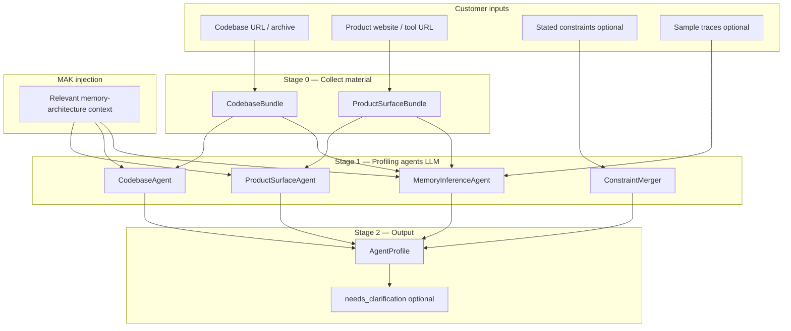
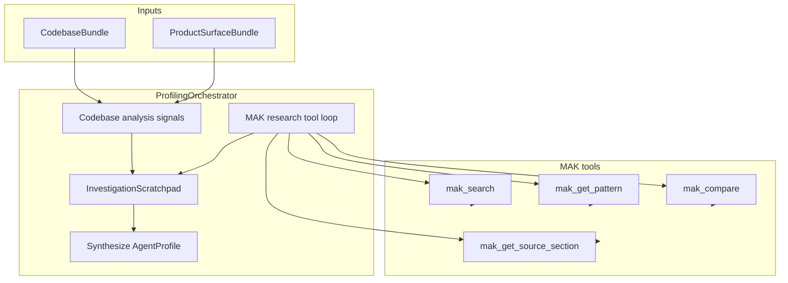

# Profiling: Understanding the Customer's Product

How Part A builds an `AgentProfile` when we have access to a **codebase**, a **product website/tool**, or **both**.

Profiling answers: *What kind of agent is this? What memory does it need? What constraints apply?*

Everything downstream — candidate composition, eval weights, recommendations — reads from this document.

**Related:** [Part A plan](part-a-analyze.md) · [MAK](memory-knowledge.md)

---

## Assumptions

| Input | We assume (v1) |
|---|---|
| **Codebase** | **Public** GitHub repo URL; shallow clone, read-only |
| **Product website / tool** | Public URL — marketing site, docs, or SaaS landing page; crawlable HTML |
| **Optional** | Customer-stated constraints, sample traces, agent spec JSON |

We do **not** assume production traffic, private repos, auth-gated docs, or runtime access in v1.

---

## Profiling pipeline overview



Three stages:

1. **Collect** — deterministic gathering into bundles (no LLM)
2. **Analyze** — LLM agents with structured output + MAK context
3. **Merge** — single `AgentProfile` with confidence + evidence

---

## Stage 0: Collect material

### CodebaseBundle (from repo)

Deterministic extraction before any LLM call.

| Category | What we pull | Why it matters for memory |
|---|---|---|
| **Tree** | Directory structure (depth 4–5) | Agent layout, services, data layer |
| **Docs** | README, ARCHITECTURE.md, CONTRIBUTING | Product intent, design decisions |
| **Deps** | `pyproject.toml`, `package.json`, `go.mod`, etc. | mem0, langchain, qdrant, neo4j, redis, zep |
| **Infra** | `docker-compose`, Terraform, K8s manifests | Databases already provisioned |
| **Agent code** | Files matching `*agent*`, `*tool*`, `*memory*`, routes | How the agent works today |
| **Data models** | Pydantic, SQLAlchemy, Prisma schemas | Entities, events, audit tables |
| **Configs** | `.env.example`, settings modules | Retention, latency hints, compliance flags |
| **Tests/fixtures** | Sample logs, conversation fixtures | Interaction patterns |

**Smart selection (token budget):**

Not the whole repo — prioritize files by signal:

```
priority 1: README, docs/, *memory*, *agent*, docker-compose*
priority 2: data models, API routes, tool definitions
priority 3: largest service modules, entry points
cap: ~80k tokens of source text (configurable)
```

```python
# Pseudocode
class CodebaseBundle(BaseModel):
    source: SourceRef                    # repo URL + commit SHA
    tree: str                            # rendered tree
    readme: str | None
    dependencies: dict[str, list[str]]   # runtime vs dev
    infra_components: list[str]          # postgres, redis, qdrant, ...
    memory_signals: list[MemorySignal]   # {file, line, snippet, kind}
    data_models: list[str]               # summarized schemas
    agent_entrypoints: list[str]         # main agent files
    selected_files: list[FileExcerpt]    # path + content excerpt
```

**MemorySignal** — regex + import detection (deterministic, cheap):

```python
class MemorySignal(BaseModel):
    file: str
    kind: Literal[
        "vector_db_import",      # qdrant, chroma, pinecone
        "graph_db_import",       # neo4j, memgraph
        "memory_framework",      # mem0, langmem, zep
        "cache_layer",           # redis
        "audit_table",           # audit_log model
        "conversation_store",    # session/history table
        "embedding_call",        # embed(), OpenAI embeddings
        "rag_pattern",           # retrieve + augment in same file
    ]
    snippet: str
```

These signals ground the LLM — not full static analysis, but more than raw tree dump.

**Public GitHub clone (v1):**

```bash
# No auth token — public repos only
git clone --depth 1 --branch {branch} {url} /tmp/membrane-clone/{job_id}
```

- Resolve default branch if `branch` omitted (`git ls-remote`)
- Record commit SHA in `SourceRef` for reproducibility
- Reject private repos with clear error (`403` / auth required) — deferred to v2
- Optional: GitHub API for tree + raw file fetch without full clone (faster for large repos)

### ProductSurfaceBundle (from website / tool URL)

Crawl the public surface of the product.

| Category | What we pull | Why it matters |
|---|---|---|
| **Landing** | Hero, value prop, feature bullets | Product type, user persona |
| **Features** | Feature pages, use-case copy | Memory needs (personalization, long-term, real-time) |
| **Docs** | Linked `/docs`, `/developers` if public | API shape, session model |
| **Enterprise** | Security, compliance, deployment pages | on-prem, SOC2, HIPAA, audit |
| **Pricing** | Tier limits | Scale hints (users, volume) |
| **Meta** | Title, description, OG tags | Quick classification |

```python
class ProductSurfaceBundle(BaseModel):
    source: SourceRef                    # URL + fetched_at
    pages: list[PageExcerpt]             # url, title, markdown content
    product_name: str | None
    tagline: str | None
    feature_list: list[str]
    compliance_mentions: list[str]       # HIPAA, SOC2, on-prem, ...
    latency_mentions: list[str]         # "real-time", "sub-second", ...
    interaction_hints: list[str]         # chat, voice, copilot, autonomous
```

**Crawl strategy:**

- Start at root URL → follow links same-domain, depth 2
- Prioritize: `/docs`, `/features`, `/security`, `/enterprise`, `/pricing`
- `trafilatura` or similar → markdown per page
- Cap: ~30 pages or ~40k tokens

### When you have one vs both

| Available | Profiling strength | Weak spots |
|---|---|---|
| **Codebase only** | Tech stack, existing memory, data models, agent architecture | Product positioning, compliance marketing claims |
| **Website only** | Product type, user journeys, enterprise constraints | Implementation detail, current memory code |
| **Both** | Cross-validate ("website says real-time" + "code has Redis cache") | Richest profile, highest confidence |

---

## Stage 1: Agentic MAK retrieval (replaces single-shot RAG)

Part A does **not** inject one static RAG blob before profiling. Profiling agents **actively query MAK** while they analyze the codebase and product — like a researcher with the repo open in one window and papers in another.

### Passive RAG vs agentic retrieval

| Single-shot RAG (old) | Agentic MAK retrieval (current) |
|---|---|
| `mak.search()` once → inject top_k | Agents call `mak_search` repeatedly as hypotheses evolve |
| Fixed context | Scratchpad grows with each tool call |
| Sequential agents only | Codebase + MAK research in parallel on shared scratchpad |
| Weak follow-up questions | `mak_compare`, `mak_get_source_section` mid-investigation |

**MAK storage is unchanged** (vector index + catalog). Only **how Part A uses it** changes: RAG is the library; agents are the readers.

### Architecture



Implementation: `membrane/analyze/orchestrator.py` · `membrane/knowledge/tools.py`

### MAK tools exposed to agents

| Tool | Purpose |
|---|---|
| `mak_search(query, tags?, limit?)` | Semantic search over papers + catalog chunks |
| `mak_get_pattern(pattern_id)` | Full structured pattern YAML fields |
| `mak_compare(pattern_ids, focus?)` | Side-by-side pattern comparison + evidence |
| `mak_get_source_section(source_id, section_path?)` | Read a paper section while reasoning |

Tool specs: `MAKToolHandler.tool_specs()` — OpenAI-compatible function definitions.

### Investigation scratchpad

Shared append-only state (`membrane/analyze/scratchpad.py`):

- `codebase_signals` / `product_signals` — from deterministic bundles  
- `mak_chunks` — evidence accumulated from tool calls  
- `hypotheses` — e.g. "likely needs temporal graph"  
- `tool_calls` — full audit trail for RecommendationReport  

Every analyze job logs **why** each search ran — critical for mentor/enterprise trust.

### Agent loop

```python
orchestrator = ProfilingOrchestrator(max_iterations=8)
result = orchestrator.run(ProfilingInput(
    codebase_bundle=codebase_bundle,
    product_bundle=product_bundle,
    stated_constraints=constraints,
))
# result.scratchpad.tool_calls → audit trail
# result.profile → ProfileDraft → full AgentProfile
```

**Modes:**

| Mode | When | Behavior |
|---|---|---|
| `heuristic` | No `MEMBRANE_LLM_API_KEY` | Rule-triggered searches from bundle signals (tests, offline) |
| `agentic` | API key set | LLM tool-calling loop until done or max iterations |

**Guardrails:** `max_iterations` (default 8), token budget per job (future), structured `ProfileDraft` output — not freeform essay.

### Optional: parallel agents

v1 runs a single orchestrator with interleaved codebase seeding + MAK research. v2 can split:

- **CodebaseAgent** — adds `code_observations` to scratchpad  
- **MAKResearchAgent** — runs tool loop from signals + hypotheses  
- **MemoryInferenceAgent** — reads scratchpad → `memory_needs`  

Merge rule unchanged: stated constraints override inferred.

---

## Stage 2: Profiling agents

v1: **LLM synthesis with agentic MAK tools** (or heuristic tool loop offline). Deterministic bundles seed the scratchpad; agents interpret and query continuously.

**Input change:** agents receive `InvestigationScratchpad` (growing evidence), not a fixed `mak_context` blob.

### Agent 1: ProductSurfaceAgent

**Runs when:** `ProductSurfaceBundle` present (website/tool URL provided)

**Input:** `ProductSurfaceBundle` + `InvestigationScratchpad` + MAK tools

**Output:**

```python
class ProductSurfaceAnalysis(BaseModel):
    product_name: str
    product_type: ProductType          # enum: chatbot, cybersecurity_agent, ...
    product_type_confidence: float
    description: str                   # 2-3 sentences
    interaction_mode: InteractionMode  # sync_chat | background_agent | voice | batch
    user_personas: list[str]
    user_journeys: list[str]           # "analyst triages alert → investigates → reports"
    implied_memory_needs: list[str]    # raw hypotheses before MemoryInferenceAgent
    evidence: list[Evidence]           # {page_url, quote}
```

**Example (cybersecurity SaaS website):**

```yaml
product_type: cybersecurity_agent
interaction_mode: background_agent
user_journeys:
  - "SOC analyst receives alert → queries historical incidents → traces root cause"
implied_memory_needs:
  - temporal event sequences
  - entity relationships between assets
  - audit trail for investigations
evidence:
  - page: /features
    quote: "Correlate alerts across your environment in seconds"
```

### Agent 2: CodebaseAgent

**Runs when:** `CodebaseBundle` present

**Input:** `CodebaseBundle` + `InvestigationScratchpad` + MAK tools

**Output:**

```python
class CodebaseAnalysis(BaseModel):
    tech_stack: list[str]
    agent_framework_signals: list[str]   # langchain, custom, crewai, ...
    existing_memory: list[ExistingMemory]  # {kind, library, location}
    data_modalities: list[DataModality]  # text, logs, structured_events, code
    infra_already_present: list[str]     # postgres, redis, neo4j
    agent_architecture_notes: str        # how agent loop works
    scale_hints: ScaleHints              # from configs, queue sizes, etc.
    evidence: list[Evidence]             # {file, line, quote}
```

**Example (security agent repo):**

```yaml
existing_memory:
  - kind: vector
    library: chromadb
    location: src/retrieval/store.py
  - kind: conversation_buffer
    library: custom
    location: src/agent/session.py
data_modalities: [structured_events, logs, text]
infra_already_present: [postgres, redis]
memory_signals_found:
  - audit table in models/audit_log.py
  - no graph database client
evidence:
  - file: src/tools/investigate.py
    quote: "Tool chains alerts by timestamp and affected host"
```

### Agent 3: MemoryInferenceAgent

**Runs when:** always (merges codebase + product analyses)

**Input:** `ProductSurfaceAnalysis?` + `CodebaseAnalysis?` + `InvestigationScratchpad` + optional `traces` + MAK tools

**Job:** Translate product understanding → memory architecture requirements.

**Output:**

```python
class MemoryInference(BaseModel):
    memory_needs: list[MemoryNeed]       # temporal, causal, entity, audit, episodic, ...
    query_patterns: list[QueryPattern]     # temporal_reasoning, similarity_lookup, ...
    session_horizon: SessionHorizon        # single_session | multi_day | multi_month
    write_pattern: WritePattern            # continuous_stream | per_turn | batch
    read_pattern: ReadPattern              # per_query | proactive_prefetch
    multimodal: bool
    rationale: str                       # plain-language why these needs
    evidence: list[Evidence]
    confidence: float
```

**Inference examples:**

| Signal | Inferred need |
|---|---|
| Alert correlation tools + timeline UI on website | `temporal`, `entity` |
| "Why did this happen?" in docs | `causal` |
| `audit_log` table in codebase | `audit` |
| Voice product page + low-latency copy | `profile`, ultra-low `latency` weight |
| Long chat sessions, no summarization in code | `episodic`, `conversation_summary` |
| Code repo graph + vector chunks | `repo_graph`, `semantic` |

MAK context helps map signals → standard taxonomy terms agents might not know cold.

### Agent 4: ConstraintMerger

**Input:** Customer-stated constraints + inferences from website + codebase

**Output:**

```python
class ConstraintsBlock(BaseModel):
    stated: Constraints | None         # from API request
    inferred: Constraints                # from bundles
    merged: Constraints                  # stated wins on conflict
    inference_notes: list[str]
    confidence: float
```

**Inference sources:**

| Constraint | From website | From codebase |
|---|---|---|
| `privacy: on_prem` | Enterprise page, "deploy in your VPC" | docker-compose only, no cloud SaaS deps |
| `latency_p99_ms` | "real-time", "sub-second" | sync API routes, streaming SSE |
| `compliance: [audit_log]` | SOC2, HIPAA mentions | audit table, immutable log pattern |
| `explainability: required` | regulated industry copy | security/finance domain |
| `budget_monthly_usd` | pricing page tier | — |

**Merge rule:** Stated constraints always override inferred. Inferred fills gaps.

---

## Stage 3: Merge → AgentProfile

Single schema consumed by compose + eval:

```python
class AgentProfile(BaseModel):
    # Provenance
    sources_analyzed: list[AnalyzedSource]
    profiled_at: datetime
    profiler_version: str

    # Product understanding
    product: ProductSummary
    interaction: InteractionSummary

    # Memory requirements (core output)
    memory_needs: list[MemoryNeed]
    query_patterns: list[QueryPattern]
    data_modalities: list[DataModality]
    session_horizon: SessionHorizon
    write_pattern: WritePattern
    read_pattern: ReadPattern

    # Current state (from codebase)
    existing_memory: list[ExistingMemory]
    infra_present: list[str]

    # Constraints + scale
    constraints: ConstraintsBlock
    scale: ScaleEstimate

    # Meta
    evidence: list[Evidence]
    confidence: ProfileConfidence
    mak_tool_calls: list[str]             # audit: tool + query summaries
    mak_evidence_ids: list[str]           # source_ids from scratchpad

    def to_search_query(self) -> str:
        """For MAK retrieval + composer."""
        ...
```

### Confidence model

Per-field and overall — drives `needs_clarification`:

```python
class ProfileConfidence(BaseModel):
    overall: float
    by_field: dict[str, float]   # product_type, memory_needs, scale, constraints, ...

# If any critical field < 0.6 → job status = needs_clarification
CRITICAL_FIELDS = ["product_type", "memory_needs", "constraints.merged"]
```

**Clarifying questions (examples):**

- "Is this agent voice or text? Website mentions both."
- "Do users share memory across sessions or per-user only?"
- "Is on-prem deployment required or optional?"

Returned via API; customer responds; profiling re-runs with answers.

---

## Scenarios

### A: Cybersecurity agent — codebase + website

**Inputs:**
- `github.com/acme/soc-copilot`
- `https://acme.com/soc-copilot`

**Collect:**
- Code: FastAPI agent, Chroma, audit_log model, alert tools, on-prem docker-compose
- Web: "SOC analyst copilot", "on-prem", "investigate incidents", SOC2 badge

**Profile output:**

```yaml
product_type: cybersecurity_agent
memory_needs: [temporal, entity, causal, audit, semantic]
query_patterns: [temporal_reasoning, causal_chains, entity_traversal, similarity_lookup]
constraints:
  merged:
    privacy: on_prem
    compliance: [audit_log, SOC2]
    explainability: required
    latency_p99_ms: 500          # inferred from "seconds" marketing — lower confidence
existing_memory:
  - {kind: vector, library: chromadb}   # migration opportunity
scale:
  events_per_day: 10000          # inferred from queue config — confidence 0.5
confidence:
  overall: 0.85
```

### B: Customer support chatbot — codebase only

**Inputs:**
- `github.com/acme/support-bot`
- No website

**Collect:**
- Next.js + Python backend, OpenAI streaming, Postgres users table, no vector DB

**Profile:**

```yaml
product_type: customer_support_chatbot
memory_needs: [semantic, episodic, profile]
query_patterns: [similarity_lookup, profile_lookup]
constraints:
  merged:
    latency_p99_ms: 2000           # inferred from streaming chat — low urgency
confidence:
  overall: 0.72                  # lower without website
```

### C: Voice agent — website only

**Inputs:**
- `https://voiceco.com/product`
- No codebase access

**Collect:**
- "AI phone agent", HIPAA, personalization, sub-200ms response

**Profile:**

```yaml
product_type: voice_agent
memory_needs: [profile, semantic]
query_patterns: [low_latency_recall, profile_lookup]
constraints:
  merged:
    latency_p99_ms: 200
    compliance: [HIPAA]
confidence:
  overall: 0.65                  # needs_clarification likely
```

---

## API shape

```json
POST /v1/analyze
{
  "sources": {
    "codebase": {
      "type": "github",
      "url": "https://github.com/acme/soc-copilot",
      "branch": "main"
    },
    "product_surface": {
      "type": "website",
      "url": "https://acme.com/soc-copilot"
    }
  },
  "constraints": {
    "latency_p99_ms": 200,
    "privacy": "on_prem"
  },
  "traces": [],
  "options": {
    "profiling_depth": "standard"
  }
}
```

At least one of `codebase` or `product_surface` required.

---

## CLI

```bash
# Both
membrane profile --repo https://github.com/acme/agent --url https://acme.com/product

# Codebase only
membrane profile --repo https://github.com/acme/agent

# Website only
membrane profile --url https://acme.com/product

# Output
membrane profile --repo ... --output profile.yaml
```

---

## What profiling does NOT do

| Out of scope | Handled by |
|---|---|
| Pick winning architecture | Compose + eval + select |
| Ingest MAK sources | `membrane knowledge` commands |
| Deploy memory | Part B |
| Access private auth-gated docs | v2 — customer upload |
| Runtime / production metrics | Observability loop (later) |

---

## Build order (profiling-specific)

| Phase | Deliverable |
|---|---|
| P0 | `CodebaseBundle` collector (tree, deps, memory signals, smart file select) |
| P1 | `ProductSurfaceBundle` crawler |
| P2 | `AgentProfile` schema + merge logic |
| P3 | Four profiling agents (LLM structured output) |
| P4 | MAK context injection |
| P5 | Confidence + `needs_clarification` flow |
| P6 | Wire into `POST /v1/analyze` |

**Bootstrap before agents:** Hand-write `examples/cybersecurity/profile.yaml` to unblock eval + compose while P0–P5 are built.

---

## Decisions

| Decision | Choice (v1) |
|---|---|
| **GitHub access** | Public repos only — shallow clone, no token |
| **Profiling** | LLM agents on CodebaseBundle + ProductSurfaceBundle |
| **Private repos** | Deferred to v2 (GitHub App / PAT) |

## Open decisions

1. **Single LLM call vs four agents** — four agents more debuggable; one call cheaper/faster for v0 prototype
2. **Clone vs GitHub API** — full shallow clone vs API-only file fetch for large repos
3. **Live product demo** — crawl website vs recorded demo video (v2)
4. **Customer trace upload** — format for conversation/event JSONL
